```{r setup, include=FALSE}
knitr::opts_chunk$set(echo = TRUE)
```


CS 625, Fall 2019

### Assignment - Part 1 - Using Application

-----

I chose Tableau to accomplish this part of the assignment. That is, to
explore the dataset and create a chart for the given questions.

> I chose bar charts for all of the questions, as it seemed as an appropriate idiom (1 categorical key value, 1 quantitative value - to look up and compare values) to answer all the questions:-  
  >    Q1 - break down on women vs. men, 
  > Q2 - total guest count for each church, and, 
  > Q3 - effect of weather on the demand for shelter each night
 


##### Exploring the dataset:

  - There were 2 ‘nest-data’ documents. While nest-data-full.csv has
    **63** rows with empty cells, nest-data.csv has 49 rows with no
    empty rows, a completely clean data.

  - Both the nest-data and nest-weather has `Date` column in common
    which starts from 11/29/2017 and ends at 1/16/2018.

  - Both these tables give the details of number of women/ men that were
    provided shelter, number of guests that turned away, temperature,
    snow, name of the church that provided shelter etc.

##### Preapring the chart in Tableau

  - First step is to connect to the datasets we are working on.

  - Then I defined the relation between them i.e. how I would want them
    to be connected/joined - full/outer/left/right etc.

  - Since both the data have `Date` column in common and both have 49
    rows, I choose inner join on Date to combine them.

  - A snapshot of how the workspace looks like once the connection is
    made to the datasets and a relation is defined between them:

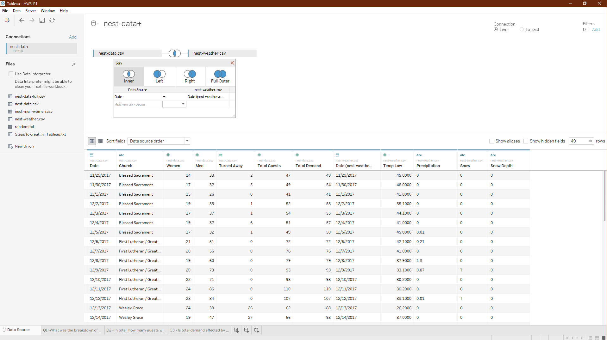

> When I started working on the assignment, from the beginning, I made
> sure I am saving everything, like images, in the same folder as it
> would be helpful and easier to refer to them in the report.md.

  - I have also created a sheet for each of the questions in the Tableau
    notebook with the question as a title for the worksheet.

A blank worksheet looks like:

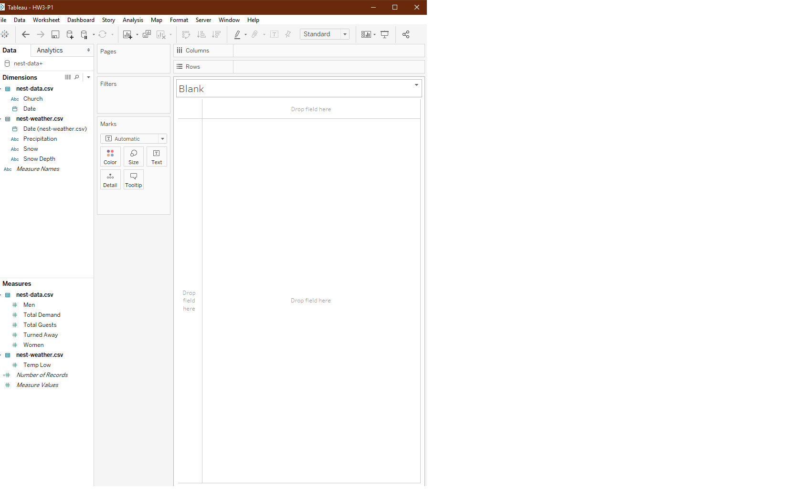

<span style="text-decoration: underline"><b> Steps in creating a chart for each Question: </b></span>

*Question 1: What was the breakdown of Women vs. men that were provided shelter each night?* 

1)  Define rows: In the side shelf, under `Measure values`, unselect
    everything except `Men` and `Women`, and, change (from the dropdown
    menu) the ‘Measure type’ from sum to attribute.

2)  Select the `+` symbol beside `year` in columns to break it down into
    month, and day.

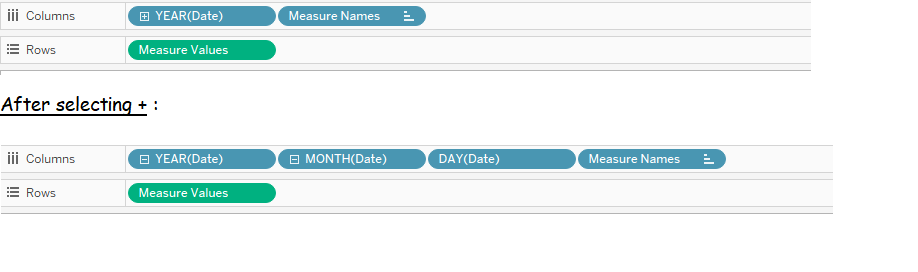 

3) Under ‘`show me`’ on the top-right side, select
side by side bar chart.

4)  Under Marks - drag the measure names into color, and change the mark
    type from `default - Line` to `Bar` and select label –\> show mark
    labels.

5)  Under each attribute from the measures shelf:

<!-- end list -->

  - Show filter to change or edit the colours of the marks.

  - Select ‘format…’ to edit the font-type/font size of the text,
    text-alignment, number formats, etc.

<!-- end list -->

6)  To edit the gap between the axis and the beginning point, `select
    the axis --> clear axis range`.

7)  Title of the page will be the name of the worksheet or it can be
    edited from the `Worksheet` tab on the top.

8)  Select -\> `Edit caption` from the worksheet tab on the top.

9)  Under File tab on the top - `save as workbook` to save all the
    sheets and workspace; Under worksheet tab on the top - `export image
    file` of the current worksheet to save it as an image.

A snapshot of how the worksheet looks like after creating the chart and
editing it:


###### Final Chart for Q1:

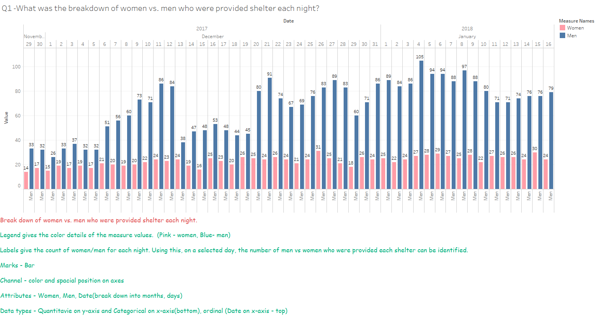


*Question 2: In total, how many guests were provided shelter by each church(or pair of churches)?*

1) Under Data tab - Drag total guests from Measures shelf to the Columns on the top; Drag church from Dimensions shelf to Rows. This automatically plots a bar chart for number of guests accoomodated by each church in total.

2) From the Marks shelf - customize the label by selecting the alignment of the text, color of the text, etc. as follows:

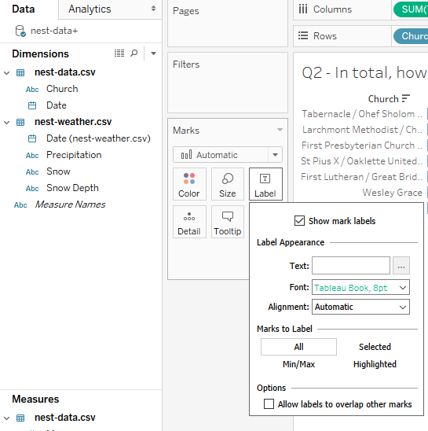

3) The color of the bar chart can also be customised from the same shelf.   

4) Beside church on y-axis, a sorting option: `sort by alphabetical order or sort by sum` is given. Selecting the `sort by sum` option would display the count of each church from increasing to decreasing order or vice versa.

5) I ordered the marks in a descending order to see the church that provided shelter for highest number of guests in total.

###### Final chart for Q2:

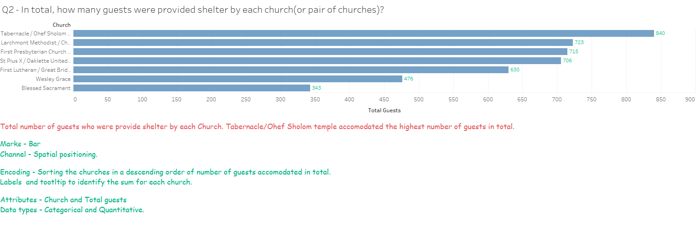

*Question 3: Is total demand for shelter affected by weather?*

1) Drag Date attribute to columns, Total demand to rows, select the Color filter on Temp low and label each mark with total demand
value. 

2) With this, the color of each mark (each bar) depends on the value of the amount of temperature low (Temp.low) for that day. That means : **The lightness or darkness of the bar color represents the weather of that given day**. The lightest bar represents the coldest day, and, the darkest bar represents the hottest day.

2) **Average line for reference** - from the analytics tab on the left side, a reference line can be added for multiple summarizing values such as mean, median, etc. I added a reference line of average total demand to see how many nights the total demand for shelter was above the average demand. 

3) As it creates automatic tool tip based on the attributes selected, the tooltip can be customized using the `tooltip` box on the marks shelf/window.

4) Similarly clicking on the reference line gives the option to edit(the values to be shown) and format it (numbers/text style, etc.).

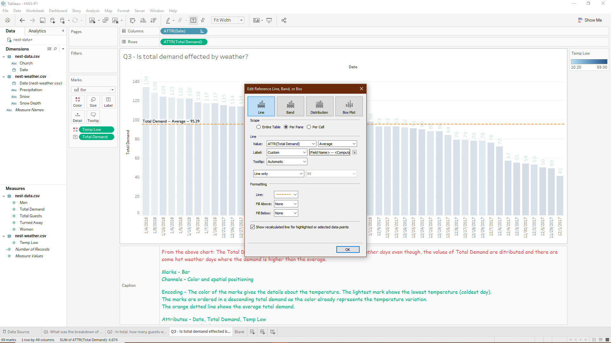

5) Clicking on the date axis label on the top of the chart gives sorting options or can be selected on the main bar on the top.

6) To identify the days with highest demand for shelter, I ordered from ascending to descending total demand values as the temperature/weather for each day is already represented by the mark color variation.

###### Final chart for Q3:

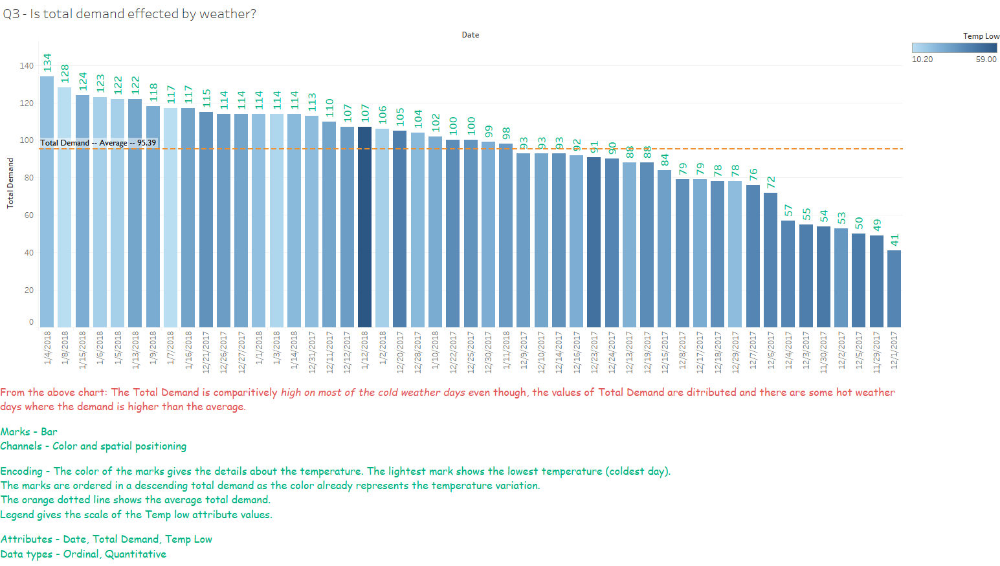
---------------

### Assignment - Part 2 - Recreating each chart using R : 

---------------

##### Steps taken to recreate each chart on R:

1) In R studio, create a new `Rnotebook` file. 

2) After editing the title and name on the document, I started creating an `r-chunks` for each of the chart. 

*Chunk 1 - Installing required libraries*

* `Package reshape2` to reshape the data as needed to create the charts

* `Package tidyverse` to clean, process, model and visualize the data

* `Lubridate` to work with the dates on the charts

* `Dplyr` to maipulate the datasets not just in r but also saving them in our system/working directory. (Even though it is included in the tidyverse, I wanted to make sure it is there. Hence I included it again individually ).

* `ggplot2` for creating the required plots

*Chunk 2 - Preparing the data to create the required charts:*

- Read the nest data csv files into the r data frames using `read.csv` function and saved them as df and df1. 

- Since there is a single common column in both the datasets, using `merge` function on both the dataframes joins them on the common column - `Date` and saved the joined dataset as `merged_data`

- To have a back up file, I created a new file `mydata` with the same data as in merged_data. This mydata file can now be used to manipulate in a way required to obtain the charts. If something goes wrong, merged_data can always be used to recover.

- To preserve the chronological order of the dates in mydata -- `arrange(parse_date_time())` function

- As I went on working on question by question, I added the required manipulation statements to this main chunk; one such calculation is churchguestcount table to tally whether ggplot was accurate for the 2nd question where the total guest count for each church was takes. 


*Chunk 3 - Q1 chart*

- As women and men guest values for each night are given in 2 separate columms, I used `melt()` function on the data which helps in reshaping it - rearranging the men and women values into a single column value. 

- This converts the data column into `factor`. This would not preserve the chronological order when plotted. Hence, I converted the column into a `character.date` column. 

> Having view statement in between the manipulations helps in keeping track of the changes and see how the manipulation is done in the table. 

> Dimensions of the figure, name of the chunk can be set inside the chunk declaration statement. This helps in displaying the figure appropriately which might be disrupted by the default dimensions.   

- As I used the `dplyr package`, this table got saved into the working directory. 

- Using `ggplot` and `geom_bar`, plotted the data into a bar chart. Using `position_Dodge()` functions gives side by side bars for each category factor - men/women.

- `labs()` function to create the labels for each axis, title, subtitle, caption for the plot. 

- The scale of the plot is automatically generated in ggplot unless we mention how to give breaks on the scale 
using `scale_y_continuous(breaks = ...)` function. (*Hence making the chart look similar to the one created in Tableau as much as possible*)

- `scale_fill_manual` to slect the colors of the marks for each category.

- Theme of the plot can be selected and edited accordingly. `?theme` gives various options that can be used. *** using `labs()` and `theme()` function majorly helped me in recreating the charts similar to the ones I have created in tableau***

- `geom_text()` and `geom_label()` functions are used to create labels inside the plot apart from the axis labels, titles, etc. I used geom_text for the mark labels and it enough served the purpose.

Here is the code I used and the final chart as a result of running it:

``` r

nest_men_women <- melt(mydata[,c('Date','Women','Men')], value.name = "value",id.vars = 1)

nest_men_women$Date <- as.character.Date(as.Date.factor((nest_men_women$Date), format = "%m/%d/%y"))

view(nest_men_women)


ggplot(nest_men_women, aes(x = Date, y = value)) +
  geom_bar(aes(fill = variable), position = position_dodge(width = 1.0), stat = "identity", width = 0.8)+
  
  labs(title = "Q1 - What is the breakdown of Women vs. Men that were provided shelter each night?", 
       x= "Date", y = "Number of Women/Men that were provided shelter each night",
       caption = "Break down of women vs. men who were provided shelter each night.
       
    Legend gives the color encoding details of the measure values (Pink - women, Blue - men)
       
    Labels give the count of women/men for each night. Using this, on a selected date, the number of men vs women who were provided shelter each night can be identified.

  **Visual Encoding:**

  Marks - Bar

  Channel - Color for break down between Women and Men values;    spacial position on axes

  Attributes - Women, Men, Date 

  Data types - Quantitative on y-axis, ordinal (Date on x-axis), categorical - men/women")+
  
  scale_fill_manual(values = c("Women" ="lightpink","Men" = "steelblue3"))+
  
  scale_y_continuous( breaks = c(20,40,60,80,100))+
  
  scale_x_discrete() +
  
  theme_light()+
  
  theme(axis.text.x = element_text(angle = 90, hjust = 1),
        axis.title.x = element_text(size=rel(1.5)),
        axis.title.y = element_text(size=rel(1.5)),
        plot.title = element_text(size = 20),
        plot.caption = element_text(colour = "#38B378", hjust = 0, size = 14),
        legend.background = element_blank(), legend.justification = c(1,1),
        axis.line.x.bottom = element_line(colour = "lightgrey", color = "lightgrey", linetype = "solid"),
        axis.line.y.left = element_line(colour = "lightgrey", color = "lightgrey", linetype = "solid"),
        axis.line.x.top = element_line(colour = "lightgrey", color = "lightgrey", linetype = "solid"),
        axis.line.y.right = element_line(colour = "lightgrey", color = "lightgrey", linetype = "solid"))+
  
  geom_text(data = nest_men_women, aes(Date, label= value), colour="black", check_overlap = TRUE, 
            vjust = -0.6, size = 3.8, position = position_dodge2(width =1.0 ), inherit.aes = TRUE)`

```
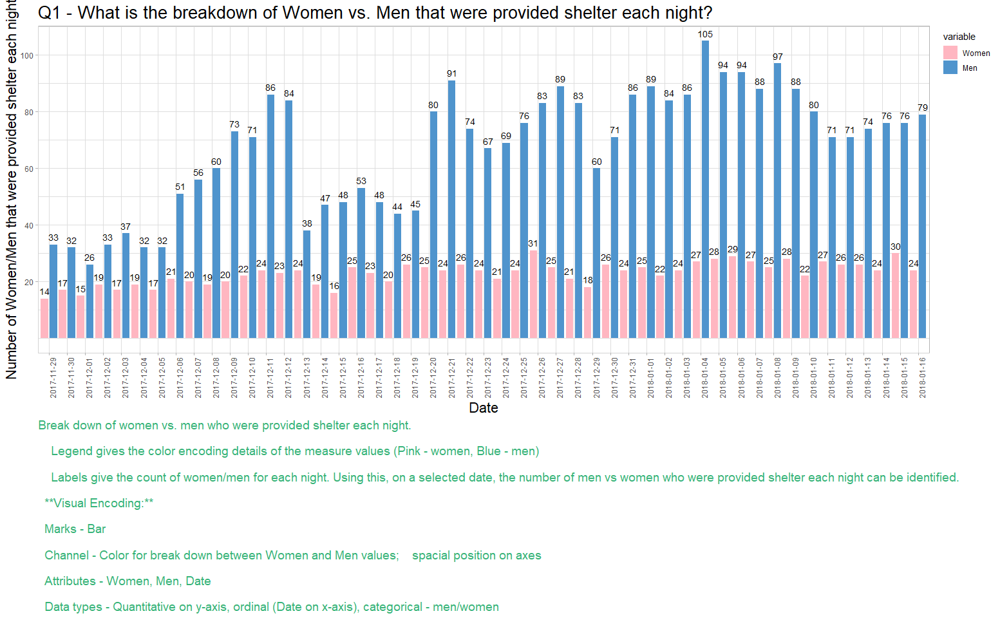


*Chunk 4 - Q2 chart*

* I created a new temporary file in which the `sum(Total.Guests)` calculated using `mydata %>% group_by(Church) %>% summarise(tot.guests = sum(Total.Guests))` is stored. `group_by` groups the values for each church and calculates the sum.

* I used the same functions `ggplot(), geom_bar(), labs(), theme(), geom_text()` to recreate the charts and make them look as similar as possible to the charts created using Tableau.

* Here, I used the `coord_flip()` to align the bars horizontally. This way, the names of the church are well aligned and easy to identify the church with highest guest count.


``` r

tmp <- mydata %>% group_by(Church) %>% summarise(tot.guests = sum(Total.Guests))

tmp$Church <- factor(tmp$Church)

ggplot(mydata, aes(reorder(Church, +Total.Guests), Total.Guests, label = Total.Guests))+
  
  geom_bar(stat = "identity", fill = "steelblue3", width = 0.5)+ 
  
  labs(title = "Q2 - In total, how many guests were given shelter by each church(or pair of churches)?", 
      x = "Name of the Church ", y = "Total number of guests that were provided shelter by each church",
      caption = " 
    The church that accomodated highest number of guests in total is Tabernacle/Ohef Sholom Temple
    
    ** Visual Encoding **
      
    Marks - Bar.
       
    Channel - Spatial positioning.

    Encoding - Sorting the churches in a descending order of number of guests accomodated in total. 

    Labels help to identify the total number of guests per each church. 

    Attributes - Church and Total guests.

    Data types - Categorical and Quantitative.")+
 
  theme_minimal(base_size = 16) +
  coord_flip()+
  
  theme(axis.text.y = element_text(size = rel(1.5)),
        axis.text.x = element_text(size = rel(1.5)),
        axis.title.x = element_text(size = rel(1.2)),
        axis.title.y = element_text(size = rel(1.2)),
        plot.title = element_text(size = 20),
        plot.caption = element_text(colour = "#38B378", hjust = 0, size = 14),
        axis.line = element_line(colour = NULL, color = NULL, linetype = 0))+
  
  geom_text(data = temp, aes(Church, tot.guests, label= tot.guests), colour="lightseagreen", 
            check_overlap = TRUE, hjust = 0, nudge_y = 10, size = 6)

```

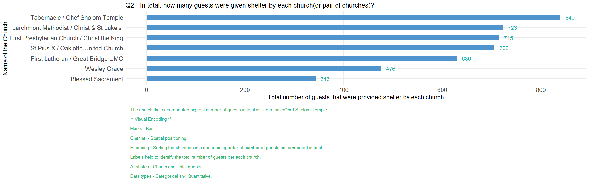


*Chunk 5 - Q3 chart*

***The key point I used in this chart is including 3 types of values in 3 channels. Temperature - Color, Length of the mark - Total demand, and the Date - ordinal attribute on X- axis.***

* A new function is used is `geom_hline(yintercept=mean(mydata$Total.Demand), color="orange", linetype = "dashed", size = 1, show.legend = TRUE, na.rm = TRUE)` for adding a reference line and `scale_fill_distiller()` to select a palette from the [color brewer](http://colorbrewer2.org/#type=sequential&scheme=Blues&n=3) and format the colour display options of the marks.   

* Rest of the functions I used are similar to that are used in recreating the previous charts. 

``` r
ggplot(mydata, aes(reorder(Date, -Total.Demand), y = Total.Demand)) +
  geom_bar(aes(fill = Temp.Low), stat = "identity", alpha= 1, width = 0.7)+
  
  guides(guide = guide_legend(reverse = TRUE))+
  
  labs(title = "Q3 - Is total demand for shelter affected by weather?", x = "Date", y = "Total Demand",
       fill="Temp Low", 
       
       caption = " 
  
    The marks are ordered in a descending total demand as the color already represents the temperature variation. 
    With reference to this, it is safe to say that most of the colder days had comparitively high total demand than 
    the hotter days. Also, more than half of the days have higher demand than the average Total Demand.  

    ** Visual Encoding **
       
    Marks - Bar
       
    Channels - Color (of the bar indicates how cold the day was), and, spatial positioning

    Encoding - The lightest mark shows the lowest temperature i.e the coldest day.

    The orange dotted line shows the Average total demand.

    Attributes - Date, Total Demand, Temp Low

    Data types - Ordinal, Quantitative")+
  
  theme_minimal()+
  
  geom_hline(yintercept=mean(mydata$Total.Demand), color="orange", linetype = "dashed", size = 1, show.legend = TRUE, na.rm = TRUE)+
  
  geom_label(aes(0, mean(mydata$Total.Demand), label = "Total.Demand -- Average -- 95.39", vjust = 0, hjust = -0.05 ), size = 5, label.size = NA, fill= "gray96", label.padding = unit(0, "lines"))+

  theme(axis.text.x = element_text(angle = 90, hjust = 1),
        legend.direction = "horizontal",
        legend.background = element_blank(),
        legend.title = element_text(),
        legend.title.align = 0,
        legend.justification = c(1,1),
        axis.title.x = element_text(size=rel(1.5)),
        axis.title.y = element_text(size=rel(1.5)),
        plot.caption = element_text(colour = "#38B378", hjust = 0, size = 14),
        plot.title = element_text(size = 20))+
  
  scale_y_continuous( breaks = c(0, 20,40,60,80,100, 120, 140))+
  
  scale_fill_distiller(palette = "Blues", aesthetics = "fill", breaks = 2:5, direction = 1, na.value = 0, space = "Lab")+
  
  geom_text(data = mydata, aes(Date, Total.Demand, label = Total.Demand), colour = "lightseagreen", angle = 90, check_overlap = TRUE, hjust = -0.25)

```

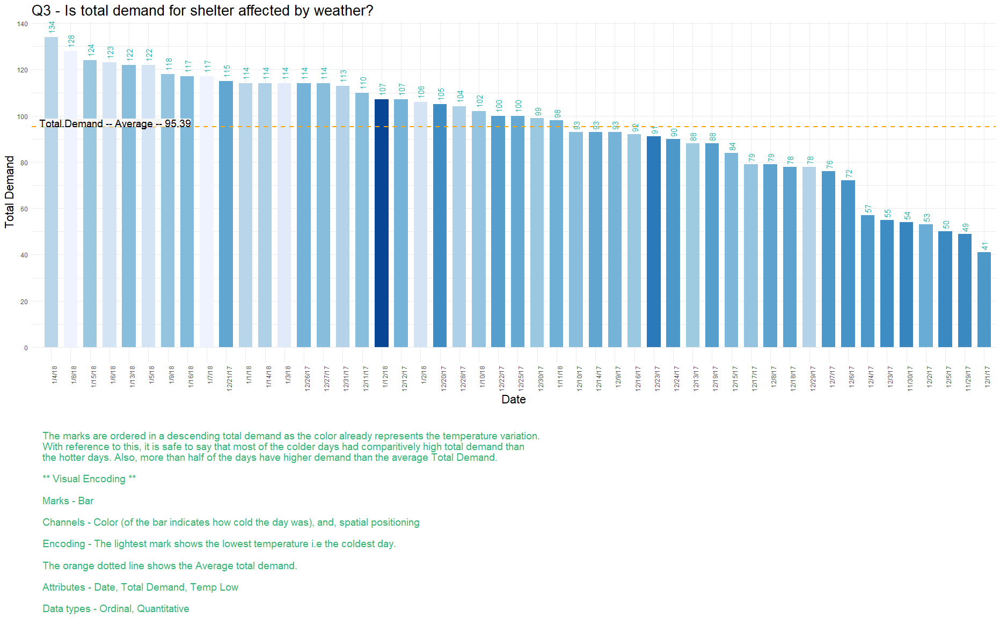


##### Take away: 

* Creating charts was comparitively easier for me in Tableau than R. However, I learned a lot using R to recreate these charts like usage of functions, column-types, arguments, understanding the types of values and axes, etc. and trying different options available to chose the appropriate one.

* All the images contain visual encoding details (for each of them) and the answers for the given questions in the form of a caption. 


##### References: 

1) [Color Brewer](http://colorbrewer2.org/)


2) [Where we can refer to all the basics we need to know about ggplot() ](https://ggplot2.tidyverse.org/reference/index.html)


3) [geom_text()](https://ggplot2.tidyverse.org/reference/geom_text.html)


4) [Quick reference to the names of R colors](http://www.stat.columbia.edu/~tzheng/files/Rcolor.pdf)


5) [geom_hline()](https://ggplot2.tidyverse.org/reference/geom_abline.html)


6) [melt() data usage](https://stackoverflow.com/questions/10212106/creating-grouped-bar-plot-of-multi-column-data-in-r)


7) [Tutorial on customising Bar Charts](https://bradleyboehmke.github.io/tutorials/barchart)


8) [Any chart basic customisation](https://www.datanovia.com/en/blog/ggplot-legend-title-position-and-labels/)


 
9) [Sorting Date](https://stackoverflow.com/questions/44436638/sorting-date-m-y-format-in-a-data-frame-in-r)


10) [Data visualization with R by Rob KAbacoff - Customizing charts](https://rkabacoff.github.io/datavis/Customizing.html)


11) [R is not so hard tutorial - Learning R](https://www.theanalysisfactor.com/r-11-bar-charts/)


12) [Ordering bars](https://sebastiansauer.github.io/ordering-bars/)


13) [R cookbook - bar graphs - ggplot()](http://www.cookbook-r.com/Graphs/Bar_and_line_graphs_(ggplot2)/#bar-graphs-of-values)


14) [Beginner's guide to R : Get your data into R](https://www.computerworld.com/article/2497164/business-intelligence-beginner-s-guide-to-r-get-your-data-into-r.html?page=4)


15) [R for data science - Aesthetic mappings](https://r4ds.had.co.nz/data-visualisation.html#aesthetic-mappings)


16) [Marks and channels tutorial](https://github.com/cs625-datavis-fall19/assignments/blob/master/Wk3-Marks-Channels-tutorial.md)

