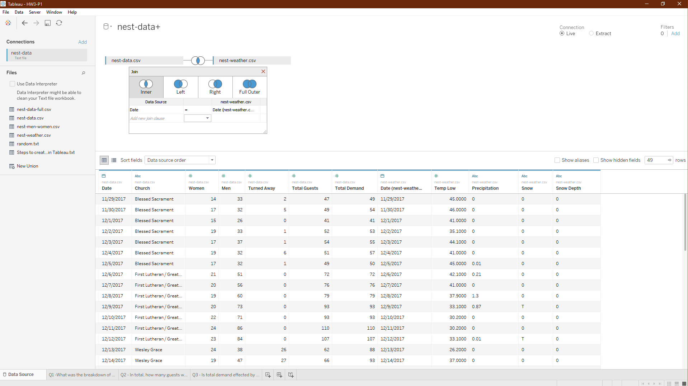
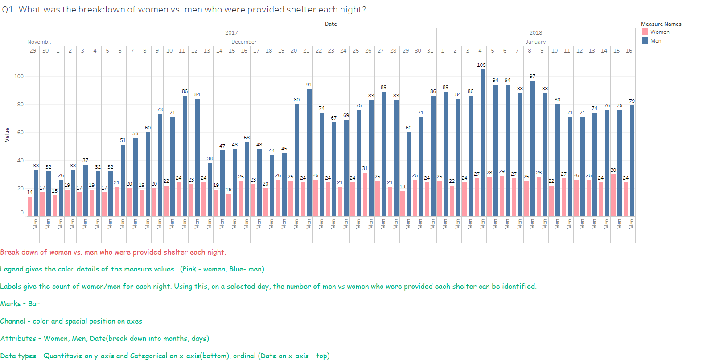
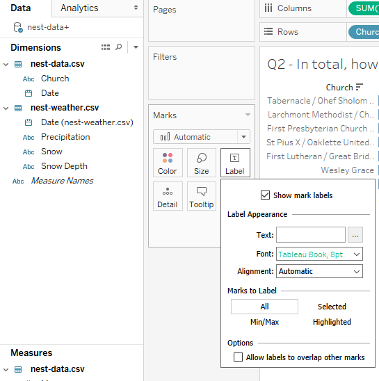
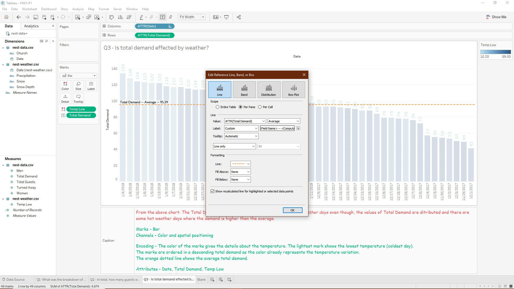
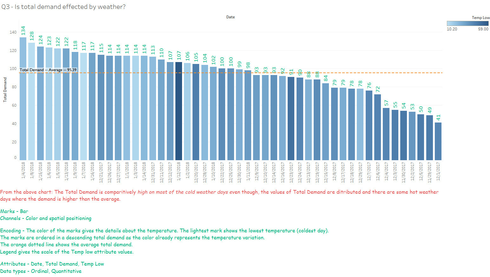
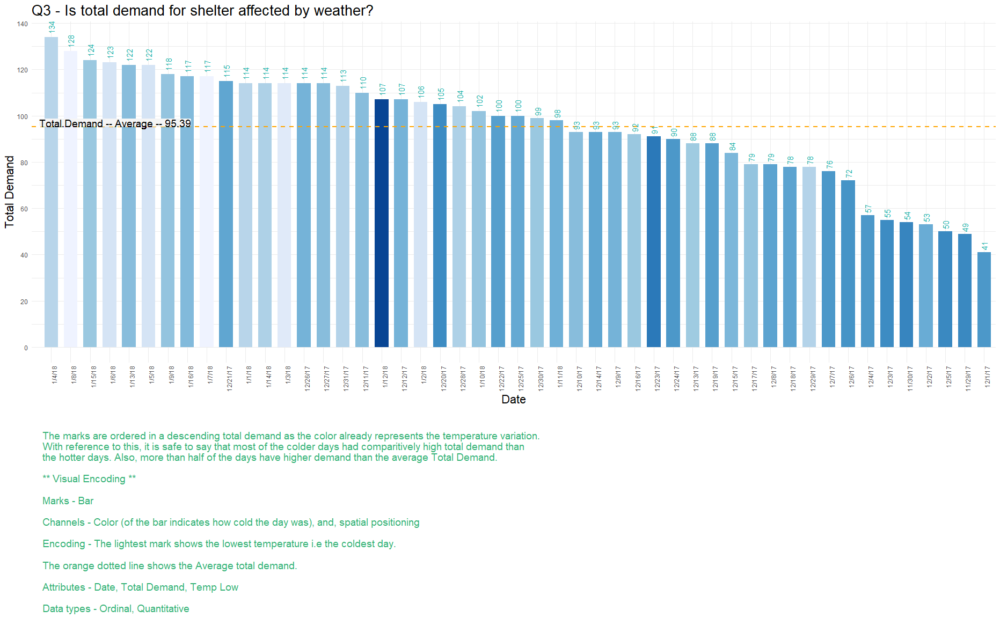

Hw 3 - Arrange Tables
================
Sai Hymavathi

CS 625, Fall 2019

### Assignment - Part 1 - Using Application

-----

I chose Tableau to accomplish this part of the assignment. That is, to
explore the dataset and create a chart for the given questions.

> I chose bar charts for all of the questions, as it seemed as an
> appropriate idiom (1 categorical key value, 1 quantitative value - to
> look up and compare values) to answer all the questions:-  
> Q1 - break down on women vs. men, Q2 - total guest count for each
> church, and, Q3 - effect of weather on the demand for shelter each
> night

##### Exploring the dataset:

  - There were 2 ‘nest-data’ documents. While nest-data-full.csv has
    **63** rows with empty cells, nest-data.csv has 49 rows with no
    empty rows, a completely clean data.

  - Both the nest-data and nest-weather has `Date` column in common
    which starts from 11/29/2017 and ends at 1/16/2018.

  - Both these tables give the details of number of women/ men that were
    provided shelter, number of guests that turned away, temperature,
    snow, name of the church that provided shelter etc.

##### Preapring the chart in Tableau

  - First step is to connect to the datasets we are working on.

  - Then I defined the relation between them i.e. how I would want them
    to be connected/joined - full/outer/left/right etc.

  - Since both the data have `Date` column in common and both have 49
    rows, I choose inner join on Date to combine them.

  - A snapshot of how the workspace looks like once the connection is
    made to the datasets and a relation is defined between them:



> When I started working on the assignment, from the beginning, I made
> sure I am saving everything, like images, in the same folder as it
> would be helpful and easier to refer to them in the report.md.

  - I have also created a sheet for each of the questions in the Tableau
    notebook with the question as a title for the worksheet.

A blank worksheet looks like:


<span style="text-decoration: underline"><b> Steps in creating a chart
for each Question: </b></span>

*Question 1: What was the breakdown of Women vs. men that were provided
shelter each night?*

1)  Define rows: In the side shelf, under `Measure values`, unselect
    everything except `Men` and `Women`, and, change (from the dropdown
    menu) the ‘Measure type’ from sum to attribute.

2)  Select the `+` symbol beside `year` in columns to break it down into
    month, and day.


3)  Under ‘`show me`’ on the top-right side, select side by side bar
    chart.

4)  Under Marks - drag the measure names into color, and change the mark
    type from `default - Line` to `Bar` and select label –\> show mark
    labels.

5)  Under each attribute from the measures shelf:

<!-- end list -->

  - Show filter to change or edit the colours of the marks.

  - Select ‘format…’ to edit the font-type/font size of the text,
    text-alignment, number formats, etc.

<!-- end list -->

6)  To edit the gap between the axis and the beginning point, `select
    the axis --> clear axis range`.

7)  Title of the page will be the name of the worksheet or it can be
    edited from the `Worksheet` tab on the top.

8)  Select -\> `Edit caption` from the worksheet tab on the top.

9)  Under File tab on the top - `save as workbook` to save all the
    sheets and workspace; Under worksheet tab on the top - `export image
    file` of the current worksheet to save it as an image.

A snapshot of how the worksheet looks like after creating the chart and
editing it:


###### Final Chart for Q1:



*Question 2: In total, how many guests were provided shelter by each
church(or pair of churches)?*

1)  Under Data tab - Drag total guests from Measures shelf to the
    Columns on the top; Drag church from Dimensions shelf to Rows. This
    automatically plots a bar chart for number of guests accoomodated by
    each church in total.

2)  From the Marks shelf - customize the label by selecting the
    alignment of the text, color of the text, etc. as follows:



3)  The color of the bar chart can also be customised from the same
    shelf.

4)  Beside church on y-axis, a sorting option: `sort by alphabetical
    order or sort by sum` is given. Selecting the `sort by sum` option
    would display the count of each church from increasing to decreasing
    order or vice versa.

5)  I ordered the marks in a descending order to see the church that
    provided shelter for highest number of guests in total.

###### Final chart for Q2:


*Question 3: Is total demand for shelter affected by weather?*

1)  Drag Date attribute to columns, Total demand to rows, select the
    Color filter on Temp low and label each mark with total demand
    value.

2)  With this, the color of each mark (each bar) depends on the value of
    the amount of temperature low (Temp.low) for that day. That means :
    **The lightness or darkness of the bar color represents the weather
    of that given day**. The lightest bar represents the coldest day,
    and, the darkest bar represents the hottest day.

3)  **Average line for reference** - from the analytics tab on the left
    side, a reference line can be added for multiple summarizing values
    such as mean, median, etc. I added a reference line of average total
    demand to see how many nights the total demand for shelter was above
    the average demand.

4)  As it creates automatic tool tip based on the attributes selected,
    the tooltip can be customized using the `tooltip` box on the marks
    shelf/window.

5)  Similarly clicking on the reference line gives the option to
    edit(the values to be shown) and format it (numbers/text style,
    etc.).



5)  Clicking on the date axis label on the top of the chart gives
    sorting options or can be selected on the main bar on the top.

6)  To identify the days with highest demand for shelter, I ordered from
    ascending to descending total demand values as the
    temperature/weather for each day is already represented by the mark
    color variation.

###### Final chart for Q3:

## 

### Assignment - Part 2 - Recreating each chart using R :

-----

##### Steps taken to recreate each chart on R:

1)  In R studio, create a new `Rnotebook` file.

2)  After editing the title and name on the document, I started creating
    an `r-chunks` for each of the chart.

*Chunk 1 - Installing required libraries*

  - `Package reshape2` to reshape the data as needed to create the
    charts

  - `Package tidyverse` to clean, process, model and visualize the data

  - `Lubridate` to work with the dates on the charts

  - `Dplyr` to maipulate the datasets not just in r but also saving them
    in our system/working directory. (Even though it is included in the
    tidyverse, I wanted to make sure it is there. Hence I included it
    again individually ).

  - `ggplot2` for creating the required plots

*Chunk 2 - Preparing the data to create the required charts:*

  - Read the nest data csv files into the r data frames using `read.csv`
    function and saved them as df and df1.

  - Since there is a single common column in both the datasets, using
    `merge` function on both the dataframes joins them on the common
    column - `Date` and saved the joined dataset as `merged_data`

  - To have a back up file, I created a new file `mydata` with the same
    data as in merged\_data. This mydata file can now be used to
    manipulate in a way required to obtain the charts. If something goes
    wrong, merged\_data can always be used to recover.

  - To preserve the chronological order of the dates in mydata –
    `arrange(parse_date_time())` function

  - As I went on working on question by question, I added the required
    manipulation statements to this main chunk; one such calculation is
    churchguestcount table to tally whether ggplot was accurate for the
    2nd question where the total guest count for each church was takes.

*Chunk 3 - Q1 chart*

  - As women and men guest values for each night are given in 2 separate
    columms, I used `melt()` function on the data which helps in
    reshaping it - rearranging the men and women values into a single
    column value.

  - This converts the data column into `factor`. This would not preserve
    the chronological order when plotted. Hence, I converted the column
    into a `character.date` column.

> Having view statement in between the manipulations helps in keeping
> track of the changes and see how the manipulation is done in the
> table.

> Dimensions of the figure, name of the chunk can be set inside the
> chunk declaration statement. This helps in displaying the figure
> appropriately which might be disrupted by the default dimensions.

  - As I used the `dplyr package`, this table got saved into the working
    directory.

  - Using `ggplot` and `geom_bar`, plotted the data into a bar chart.
    Using `position_Dodge()` functions gives side by side bars for each
    category factor - men/women.

  - `labs()` function to create the labels for each axis, title,
    subtitle, caption for the plot.

  - The scale of the plot is automatically generated in ggplot unless we
    mention how to give breaks on the scale using
    `scale_y_continuous(breaks = ...)` function. (*Hence making the
    chart look similar to the one created in Tableau as much as
    possible*)

  - `scale_fill_manual` to slect the colors of the marks for each
    category.

  - Theme of the plot can be selected and edited accordingly. `?theme`
    gives various options that can be used. \*\*\* using `labs()` and
    `theme()` function majorly helped me in recreating the charts
    similar to the ones I have created in tableau\*\*\*

  - `geom_text()` and `geom_label()` functions are used to create labels
    inside the plot apart from the axis labels, titles, etc. I used
    geom\_text for the mark labels and it enough served the purpose.

Here is the code I used and the final chart as a result of running it:

``` r

nest_men_women <- melt(mydata[,c('Date','Women','Men')], value.name = "value",id.vars = 1)

nest_men_women$Date <- as.character.Date(as.Date.factor((nest_men_women$Date), format = "%m/%d/%y"))

view(nest_men_women)


ggplot(nest_men_women, aes(x = Date, y = value)) +
  geom_bar(aes(fill = variable), position = position_dodge(width = 1.0), stat = "identity", width = 0.8)+
  
  labs(title = "Q1 - What is the breakdown of Women vs. Men that were provided shelter each night?", 
       x= "Date", y = "Number of Women/Men that were provided shelter each night",
       caption = "Break down of women vs. men who were provided shelter each night.
       
    Legend gives the color encoding details of the measure values (Pink - women, Blue - men)
       
    Labels give the count of women/men for each night. Using this, on a selected date, the number of men vs women who were provided shelter each night can be identified.

  **Visual Encoding:**

  Marks - Bar

  Channel - Color for break down between Women and Men values;    spacial position on axes

  Attributes - Women, Men, Date 

  Data types - Quantitative on y-axis, ordinal (Date on x-axis), categorical - men/women")+
  
  scale_fill_manual(values = c("Women" ="lightpink","Men" = "steelblue3"))+
  
  scale_y_continuous( breaks = c(20,40,60,80,100))+
  
  scale_x_discrete() +
  
  theme_light()+
  
  theme(axis.text.x = element_text(angle = 90, hjust = 1),
        axis.title.x = element_text(size=rel(1.5)),
        axis.title.y = element_text(size=rel(1.5)),
        plot.title = element_text(size = 20),
        plot.caption = element_text(colour = "#38B378", hjust = 0, size = 14),
        legend.background = element_blank(), legend.justification = c(1,1),
        axis.line.x.bottom = element_line(colour = "lightgrey", color = "lightgrey", linetype = "solid"),
        axis.line.y.left = element_line(colour = "lightgrey", color = "lightgrey", linetype = "solid"),
        axis.line.x.top = element_line(colour = "lightgrey", color = "lightgrey", linetype = "solid"),
        axis.line.y.right = element_line(colour = "lightgrey", color = "lightgrey", linetype = "solid"))+
  
  geom_text(data = nest_men_women, aes(Date, label= value), colour="black", check_overlap = TRUE, 
            vjust = -0.6, size = 3.8, position = position_dodge2(width =1.0 ), inherit.aes = TRUE)`
```


*Chunk 4 - Q2 chart*

  - I created a new temporary file in which the `sum(Total.Guests)`
    calculated using `mydata %>% group_by(Church) %>%
    summarise(tot.guests = sum(Total.Guests))` is stored. `group_by`
    groups the values for each church and calculates the sum.

  - I used the same functions `ggplot(), geom_bar(), labs(), theme(),
    geom_text()` to recreate the charts and make them look as similar as
    possible to the charts created using Tableau.

  - Here, I used the `coord_flip()` to align the bars horizontally. This
    way, the names of the church are well aligned and easy to identify
    the church with highest guest count.

<!-- end list -->

``` r

tmp <- mydata %>% group_by(Church) %>% summarise(tot.guests = sum(Total.Guests))

tmp$Church <- factor(tmp$Church)

ggplot(mydata, aes(reorder(Church, +Total.Guests), Total.Guests, label = Total.Guests))+
  
  geom_bar(stat = "identity", fill = "steelblue3", width = 0.5)+ 
  
  labs(title = "Q2 - In total, how many guests were given shelter by each church(or pair of churches)?", 
      x = "Name of the Church ", y = "Total number of guests that were provided shelter by each church",
      caption = " 
    The church that accomodated highest number of guests in total is Tabernacle/Ohef Sholom Temple
    
    ** Visual Encoding **
      
    Marks - Bar.
       
    Channel - Spatial positioning.

    Encoding - Sorting the churches in a descending order of number of guests accomodated in total. 

    Labels help to identify the total number of guests per each church. 

    Attributes - Church and Total guests.

    Data types - Categorical and Quantitative.")+
 
  theme_minimal(base_size = 16) +
  coord_flip()+
  
  theme(axis.text.y = element_text(size = rel(1.5)),
        axis.text.x = element_text(size = rel(1.5)),
        axis.title.x = element_text(size = rel(1.2)),
        axis.title.y = element_text(size = rel(1.2)),
        plot.title = element_text(size = 20),
        plot.caption = element_text(colour = "#38B378", hjust = 0, size = 14),
        axis.line = element_line(colour = NULL, color = NULL, linetype = 0))+
  
  geom_text(data = temp, aes(Church, tot.guests, label= tot.guests), colour="lightseagreen", 
            check_overlap = TRUE, hjust = 0, nudge_y = 10, size = 6)
```


*Chunk 5 - Q3 chart*

***The key point I used in this chart is including 3 types of values in
3 channels. Temperature - Color, Length of the mark - Total demand, and
the Date - ordinal attribute on X- axis.***

  - A new function is used is
    `geom_hline(yintercept=mean(mydata$Total.Demand), color="orange",
    linetype = "dashed", size = 1, show.legend = TRUE, na.rm = TRUE)`
    for adding a reference line and `scale_fill_distiller()` to select a
    palette from the [color
    brewer](http://colorbrewer2.org/#type=sequential&scheme=Blues&n=3)
    and format the colour display options of the marks.

  - Rest of the functions I used are similar to that are used in
    recreating the previous charts.

<!-- end list -->

``` r
ggplot(mydata, aes(reorder(Date, -Total.Demand), y = Total.Demand)) +
  geom_bar(aes(fill = Temp.Low), stat = "identity", alpha= 1, width = 0.7)+
  
  guides(guide = guide_legend(reverse = TRUE))+
  
  labs(title = "Q3 - Is total demand for shelter affected by weather?", x = "Date", y = "Total Demand",
       fill="Temp Low", 
       
       caption = " 
  
    The marks are ordered in a descending total demand as the color already represents the temperature variation. 
    With reference to this, it is safe to say that most of the colder days had comparitively high total demand than 
    the hotter days. Also, more than half of the days have higher demand than the average Total Demand.  

    ** Visual Encoding **
       
    Marks - Bar
       
    Channels - Color (of the bar indicates how cold the day was), and, spatial positioning

    Encoding - The lightest mark shows the lowest temperature i.e the coldest day.

    The orange dotted line shows the Average total demand.

    Attributes - Date, Total Demand, Temp Low

    Data types - Ordinal, Quantitative")+
  
  theme_minimal()+
  
  geom_hline(yintercept=mean(mydata$Total.Demand), color="orange", linetype = "dashed", size = 1, show.legend = TRUE, na.rm = TRUE)+
  
  geom_label(aes(0, mean(mydata$Total.Demand), label = "Total.Demand -- Average -- 95.39", vjust = 0, hjust = -0.05 ), size = 5, label.size = NA, fill= "gray96", label.padding = unit(0, "lines"))+

  theme(axis.text.x = element_text(angle = 90, hjust = 1),
        legend.direction = "horizontal",
        legend.background = element_blank(),
        legend.title = element_text(),
        legend.title.align = 0,
        legend.justification = c(1,1),
        axis.title.x = element_text(size=rel(1.5)),
        axis.title.y = element_text(size=rel(1.5)),
        plot.caption = element_text(colour = "#38B378", hjust = 0, size = 14),
        plot.title = element_text(size = 20))+
  
  scale_y_continuous( breaks = c(0, 20,40,60,80,100, 120, 140))+
  
  scale_fill_distiller(palette = "Blues", aesthetics = "fill", breaks = 2:5, direction = 1, na.value = 0, space = "Lab")+
  
  geom_text(data = mydata, aes(Date, Total.Demand, label = Total.Demand), colour = "lightseagreen", angle = 90, check_overlap = TRUE, hjust = -0.25)
```



##### Take away:

  - Creating charts was comparitively easier for me in Tableau than R.
    However, I learned a lot using R to recreate these charts like usage
    of functions, column-types, arguments, understanding the types of
    values and axes, etc. and trying different options available to
    chose the appropriate one.

  - All the images contain visual encoding details (for each of them)
    and the answers for the given questions in the form of a caption.

##### References:

1)  [Color Brewer](http://colorbrewer2.org/)

2)  [Where we can refer to all the basics we need to know about
    ggplot()](https://ggplot2.tidyverse.org/reference/index.html)

3)  [geom\_text()](https://ggplot2.tidyverse.org/reference/geom_text.html)

4)  [Quick reference to the names of R
    colors](http://www.stat.columbia.edu/~tzheng/files/Rcolor.pdf)

5)  [geom\_hline()](https://ggplot2.tidyverse.org/reference/geom_abline.html)

6)  [melt() data
    usage](https://stackoverflow.com/questions/10212106/creating-grouped-bar-plot-of-multi-column-data-in-r)

7)  [Tutorial on customising Bar
    Charts](https://bradleyboehmke.github.io/tutorials/barchart)

8)  [Any chart basic
    customisation](https://www.datanovia.com/en/blog/ggplot-legend-title-position-and-labels/)

9)  [Sorting
    Date](https://stackoverflow.com/questions/44436638/sorting-date-m-y-format-in-a-data-frame-in-r)

10) [Data visualization with R by Rob KAbacoff - Customizing
    charts](https://rkabacoff.github.io/datavis/Customizing.html)

11) [R is not so hard tutorial - Learning
    R](https://www.theanalysisfactor.com/r-11-bar-charts/)

12) [Ordering bars](https://sebastiansauer.github.io/ordering-bars/)

13) [R cookbook - bar graphs -
    ggplot()](http://www.cookbook-r.com/Graphs/Bar_and_line_graphs_\(ggplot2\)/#bar-graphs-of-values)

14) [Beginner’s guide to R : Get your data into
    R](https://www.computerworld.com/article/2497164/business-intelligence-beginner-s-guide-to-r-get-your-data-into-r.html?page=4)

15) [R for data science - Aesthetic
    mappings](https://r4ds.had.co.nz/data-visualisation.html#aesthetic-mappings)

16) [Marks and channels
    tutorial](https://github.com/cs625-datavis-fall19/assignments/blob/master/Wk3-Marks-Channels-tutorial.md)
