Hw5 - Distribution charts
================
Sai Majeti

CS 625 - Hw5, Fall 2019

### Creating distrubutions charts:

For each of the distributions, I have created 2 histograms, 1 eCDF and 1
boxplot as asked. The following sections describe the charts for each
distribution and discusses which idiom suited best as well as the pros
and cons of other distribution idioms for each of the distribution.

#### Movielens - Distribution:

###### Histogram:

  - Histogram - 1

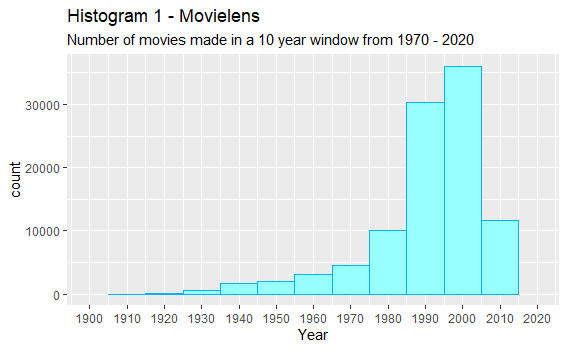

For this dataset, I have created **2 histograms with binwidths 10 and
5** respectively (the bin width sets the interval for each of the bin).
The x - axis shows the years that movies were made and y - axis shows
the count(number) of movies made in that given interval of years. This
histogram reveals that the highest number of movies were made between
1995 and 2005, 1985 - 1995 being the second highest.

> Playing around with the bin widths reveals more instrinsic details
> about the distributions.

  - Histogram - 2

I wanted to see the exact interval that the highest number of movies
were made and reduced the bin width. This helped me discover that the
highest number of movies were made between the period 1993 and 1997
precisely. We can also see how the distribution in other 5 year periods
varies from the 10 - year interval histogram. Increasing and reducing
the bin width sometimes helps us look deep into the distribution
patterns. **If we set the bin width to 1, we can see the exact number of
movies made for each year.**

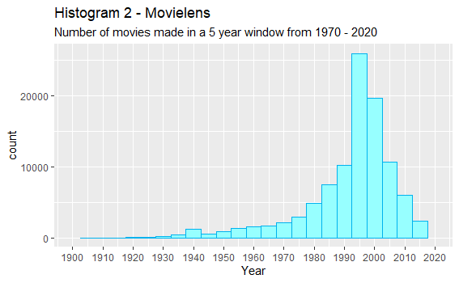

###### eCDF:

Empirical cumulative distributive function normalizes the count on the y
- axis, so, here we will be able to read what proportion/percentage of
movies were made in each year. In the chart I have created, the
proprtions are shown for each year in the form of a step. \*\* The
difference between the present step and the previous step gives the
proportion of movies made for that year.\*\* We can trace the x and y-
axis values at each step in the chart.

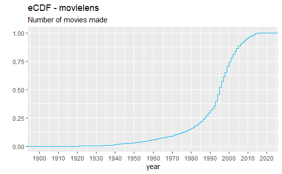

###### Boxplot:

Boxplot also shows the percentiles/quartiles for a distribution, unlike
the exact count in a histogram, in the order (from left to right):
points or dot marks provides the information about the outliers,
whiskers/lines provide information about minimum and maximum extremes
after which values are considered outliers, first box shows the 25th,
second box 75th percentile and the line in the middle is median of the
distribution. The box is called interquartile range.

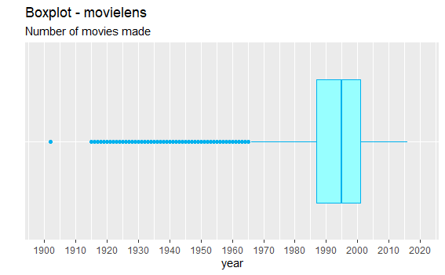

The x-axis shows the years. Through the boxplot, we can see that most of
the values fall below the median and there are multiple outliers. This
might be because of the individual year values for which there is not
much repitition. I have flipped the axes as it shows the details in the
plot more clearly.

The code I have used to create the distribution charts for this dataset
is:

``` r
#histogram 1 - binwidth = 10
ggplot(movielens, aes(year)) + 
  geom_histogram(binwidth = 10, fill = "darkslategray1", col = "deepskyblue2", na.rm = TRUE) +
  xlab("Year") +
  ggtitle(label = "Histogram 1 - Movielens",
          subtitle = "Number of movies made in a 10 year window from 1970 - 2020") +
  scale_x_continuous(limits = c(1900, 2020), breaks = seq(1900,2020, 10))
  

#histogram 2 binwidth = 5
ggplot(movielens, aes(year)) + 
  geom_histogram(binwidth = 5, fill = "darkslategray1", col = "deepskyblue2", na.rm = TRUE) +
  xlab("Year") +
  ggtitle(label = "Histogram 2 - Movielens",
          subtitle = "Number of movies made in a 5 year window from 1970 - 2020") +
  scale_x_continuous(limits = c(1900, 2020), breaks = seq(1900,2020, 10))

#ecdf
ggplot(movielens, aes(year)) + stat_ecdf(geom = "step", na.rm = TRUE, col = "deepskyblue2") +
  scale_x_continuous(limits = c(1900, 2020), breaks = seq(1900,2020, 10)) + 
  ylab("") + 
  ggtitle(label = "eCDF - movielens" , subtitle = "Number of movies made")
  

#boxplot
ggplot(movielens, aes(y = year, x = "")) + 
  geom_boxplot(na.rm = TRUE, col = "deepskyblue2", fill = "darkslategray1") + 
  coord_flip() +
  xlab("") +
  theme(axis.ticks.y = element_blank()) + 
  scale_y_continuous(limits = c(1900, 2020), breaks = seq(1900,2020, 10)) + 
  ggtitle(label = "Boxplot - movielens", subtitle = "Number of movies made")
```

***Best suited idiom*** for this plot would be the *histogram* as we are
able to see the years in which most number of movies were made in the
first look at the plot itself. A complicated idiom would be the eCDF and
boxplot as most of us would not want to calculate
percentiles/proportions for each year but get a generalised look at the
distribution and know what were the years that most number of movies
were made.

#### Stars - Distribution:

###### Histogram

  - Histogram 1

For this dataset, I have plotted two histograms using **binwidths 1 and
5**. On x- axis, the magnitude of the stars is shown and on the y -
axis, we can see the count of stars belonging to that magnitude
interval. We can see how the distribution varies with the variation of
number of bins.

For the first one, the **binwidth is 1** and it shows two peak points at
-5, -15 and number of other higher count magnitude values. The plot
almost looks like two adjacent normal distributions. Each bin shows the
number of stars for each magnitude value.

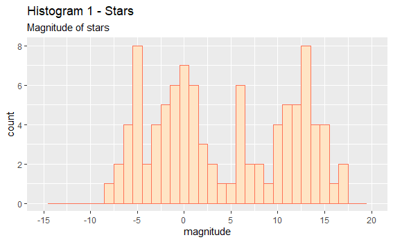

  - Histogram 2

The **binwidth is increased here to 5** resulting in the broadening of
the magnitude value interval. Each bin shows the number of stars for 5
magnitude values instead of 1 value like histogram 1. Unlike the first
histogram, this one shows only one peak point approximately from -3 to
3. And, the count for other values is distributed gradually.

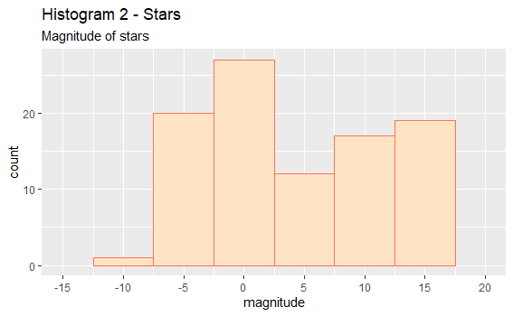

###### eCDF

The scale of the axes and the axes plotting is similar to the above
plots for stars. The eCDF show the proportion instead of count of stars
for each magnitude values and similar to the first histogram, the
proportion of stars for each magnitude value is distributed.

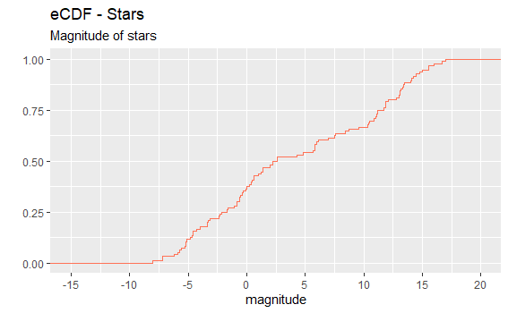

###### Boxplot

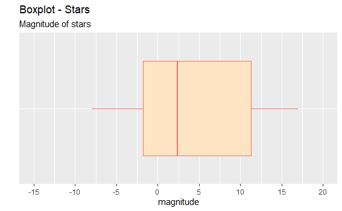

Unlike the above 3 plots, the boxplot for this dataset helps us discover
a new pattern in the values i.e, most of the stars have magnitude above
the median value and the distribution is skewed toward the rightside of
the median.

The code I have used to create plots for this dataset is:

``` r
# histogram - 1; binwidth 1
ggplot(stars, aes(magnitude)) + 
  geom_histogram(na.rm = TRUE, binwidth = 1, fill = "bisque", col = "coral1") + 
  scale_x_continuous(limits = c(-15, 20), breaks = seq(-15,20,5))+ 
  ggtitle(label = "Histogram 1 - Stars",
          subtitle = "Magnitude of stars")
  

#histogram - 2, binwidth 5
ggplot(stars, aes(magnitude)) + 
  geom_histogram(na.rm = TRUE, binwidth = 5, fill = "bisque", col = "coral1") +
  scale_x_continuous(limits = c(-15, 20), breaks = seq(-15, 20, 5))+
  ggtitle(label= "Histogram 2 - Stars",
          subtitle = "Magnitude of stars")

#ecdf
ggplot(stars, aes(magnitude)) + 
  stat_ecdf(geom = "step", na.rm = TRUE, col = "coral1") + 
  scale_x_continuous(limits = c(-15, 20), breaks = seq(-15, 20, 5))+
  ggtitle(label = "eCDF - Stars", subtitle = "Magnitude of stars")+
  ylab("")

#boxplot
ggplot(stars, aes(y = magnitude, x = "")) + 
  geom_boxplot(na.rm = TRUE, col = "coral1", fill = "bisque") +
  coord_flip() + 
  xlab("") + 
  theme(axis.ticks.y = element_blank()) +
  scale_y_continuous(limits = c(-15, 20), breaks = seq(-15, 20, 5))+
  ggtitle(label="Boxplot - Stars", subtitle = "Magnitude of stars")
```

All the idioms give a little bit of insight, in their own ways, into
this dataset: - Boxplot to observe the skewedness of the distribution -
Histogram to know the count of values for each interval - eCDF to
calculate the proprtions of occurence of all the values; But, to pick a
***best suited idiom*** for this distribution, it will be the eCDF as we
will be able to calculate the proportions of distribution for each value
(if calculation the proportions and converting them to know the number
is not a problem).

#### Outlier\_example - Distribution

In this outlier\_example dataset, there is a value which might be a
wrong entry, therefore, making this an example for outliers. I have
examined the dataset and found that there is only value that is close to
180 which is making it difficult for us to observe the distribution of
the other actual values which are between 5 and 8. Hence, I decided to
plot the distributions twice - one with the outlier and one without the
outlier.

I have plotted two histograms again but **instead of using bin width**,
I have used **bins** argument to adjust the number of bins in the plot.

###### Histogram

  - Histogram 1

The first histogram uses less number of **bins = 50** and it creates
intervals of 5 values, for which our dataset has only 3 bins - a peak
one close to 10, one small bin between 0-5 and a very small - almost
unnoticable bin around 180. We cannot see much details about the
distribution other than a single bin.

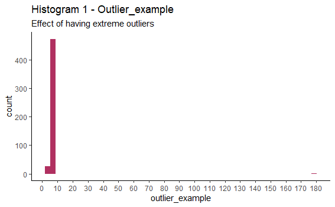

  - Histogram 2

Similar to the histogram 1, even after I had **increased the number of
bins from 50 to 100** , the pattern distribution is not clear. It looks
just like a single peak bin between 5 and 10 again.

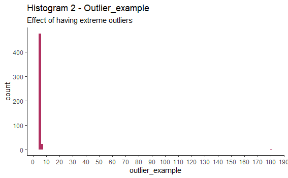

###### eCDF

Even using a eCDF, we can only see that 99 percentile of values or 0.9
proportion of values fall below the value 10, but we cannot see the
actual distribution of values. However, unlike the histograms we are at
least able to see that large number of values fall between \~ 30 and \~
80 percentile. This is a new insight about the distribution.

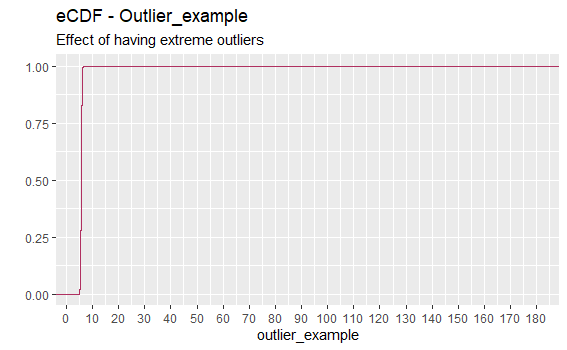

###### Boxplot

The box plot also just shows a single line, couple of dots below the
value 10 and a dot mark for the outlier. We are not able to see any
other details about the distribution such as median, interquartile
range, max. and min. values which can usually be determined by a
boxplot.

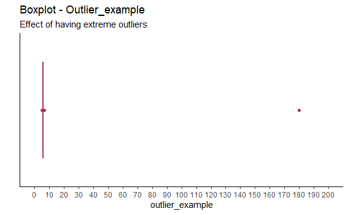

> I did not analyze the best suited idiom for this distribution yet as I
> want to see how the distribution looks without the outlier. But, to
> consider with the outlier, the eCDF plot at least gives a better
> picture of the distribution as we can easily trace the x,y coordinates
> and determine the proportions of the occurence of the values unlike
> the other plots.

``` r
#histogram - binws 50
ggplot(mapping = aes(outlier_example)) + 
  geom_histogram(na.rm = TRUE, fill = "maroon", bins = 50) + 
  scale_x_continuous(breaks = seq(0, 200, 10)) +
  theme_classic()+
  ggtitle(label="Histogram 1 - Outlier_example", subtitle = "Effect of having extreme outliers")

#histogram - bins 100
ggplot(mapping = aes(outlier_example)) +
  geom_histogram(na.rm = TRUE, fill = "maroon", bins = 100) +
  scale_x_continuous(breaks = seq(0, 200, 10)) + 
  theme_classic() +
  ggtitle(label="Histogram 2 - Outlier_example", subtitle = "Effect of having extreme outliers")
  
#ecdf
ggplot(mapping = aes(outlier_example)) +
  stat_ecdf(geom = "step", na.rm = TRUE, col = "maroon")+
  scale_x_continuous(breaks = seq(0, 200, 10)) +
  ggtitle(label="eCDF - Outlier_example", subtitle = "Effect of having extreme outliers")+
  ylab("")

#boxplot
ggplot(mapping = aes(y = outlier_example, x = "")) + 
  geom_boxplot(na.rm = TRUE, fill = "honeydew2", col = "maroon") + coord_flip() +
  xlab("") + 
  theme_classic() +
  scale_y_continuous(limits =c(0, 200), breaks = seq(0, 200, 10)) +
  ggtitle(label="Boxplot - Outlier_example", subtitle = "Effect of having extreme outliers")+
  theme(axis.ticks.y = element_blank())
```

#### Outlier\_example - Distribution without the outlier

In this section, I have eliminated the plotting of outliers by adjusting
the x axis limits between 5 and 8. Now we are able to clearly understand
the pattern of distribution in more detail. This shows how having an
outlier can completely change the pattern of a distribution as well as
how important it is to notice and consider unusual patterns through
plotting.

###### Histogram

As usual, I have created histograms of two different **bin widths 0.5
and 0.1**. Both the distributions look like a normal distribution with a
slight dfference at the end of the pattern for both the histograms. Most
of the values fall in between 5.6 and 5.8 (peak of the distribution).

  - Histogram 1

The ditribution shows that the highest number of values are in the range
of \~5.3 and \~5.7 at the beginning. Having a borader bin width is not
allowing us to see the distribution. Hence I have reduced the bin width
in the second histogram and the difference can easily be seen that the
narrower bin width gives more details about the distribution.

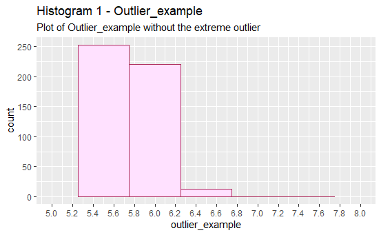

  - Histogram 2

Changing the **binwidth to 0.1** reveals that the values are distributed
like a normal distribution unlike just showing the peak values as in
histogram - 1. Here, most of the values fall in between 5.6 and 5.8
(peak of the distribution) and the count for other values can also be
easily noticed here.

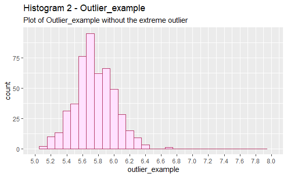

###### \- eCDF

By removing the outlier, through eCDF, we are able to clearly see the
proportions of all the values in the distribution with the median at \~
5.7 and the distribution plateaued at \~ 6.4.

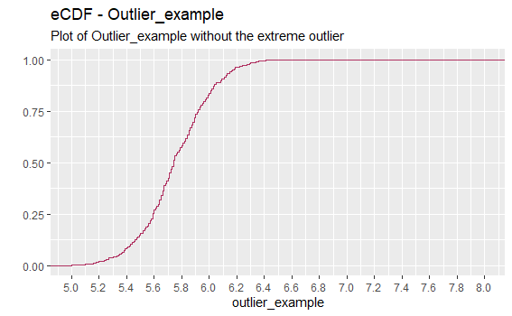

###### \- Boxplot

Boxplot reveals similar discoveries to the eCDF that the median falls
around 5.7. We can also see that most of the values in the distribution
are towards the right (above) of the median value.

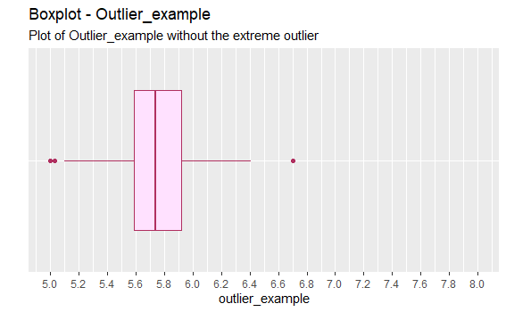

The R code I have used to create these plots is:

``` r
#histogram
#histogram - binwidth 0.5
ggplot(mapping = aes(outlier_example)) + 
  geom_histogram(na.rm = TRUE, fill = "thistle1", col = "maroon", binwidth = 0.5) + 
  scale_x_continuous(limits = c(5, 8), breaks = seq(5, 8, 0.2)) +
  ggtitle(label="Histogram 1 - Outlier_example", subtitle = "Plot of Outlier_example without the extreme outlier")

#histogram - binwidth 0.1
ggplot(mapping = aes(outlier_example)) +
  geom_histogram(na.rm = TRUE, col = "maroon", fill = "thistle1", binwidth = 0.1) +
  scale_x_continuous(limits = c(5, 8), breaks = seq(5, 8, 0.2)) + 
  ggtitle(label="Histogram 2 - Outlier_example", subtitle = "Plot of Outlier_example without the extreme outlier")
  
#ecdf
ggplot(mapping = aes(outlier_example)) +
  stat_ecdf(geom = "step", na.rm = TRUE, col = "maroon") +
  scale_x_continuous(limits = c(5, 8), breaks = seq(5, 8, 0.2)) +
  ggtitle(label="eCDF - Outlier_example", subtitle = "Plot of Outlier_example without the extreme outlier")+ ylab("")
  

#boxplot
ggplot(mapping = aes(y = outlier_example, x = "")) + 
  geom_boxplot(na.rm = TRUE, fill = "thistle1", col = "maroon") + coord_flip() +
  xlab("") + 
  scale_y_continuous(limits = c(5, 8), breaks = seq(5, 8, 0.2)) +
  ggtitle(label="Boxplot - Outlier_example", subtitle = "Plot of Outlier_example without the extreme outlier")+
  theme(axis.ticks.y = element_blank())
```

***Best suited idiom for this distribution*** according to me is a
*Histogram* since it allows us to see the value with the highest count
and we are also able to further figure out which are the next highest
count values through the plot. *eCDF* also gives a better insight into
the distribution as it looks easy to trace the x and y - coordinates and
determine the proprtions. However, it might be a little more complicated
than a histogram. *Boxplot* here, only gives the quartile ranges, median
of the distribution. We cannot easily tell the value which is repeated
highest number of times as in the other two idioms above.

> One final thing I would like to mention is that I have noticed that
> *eCDF*s give more detail into the distribution. However, sometimes it
> might not be needed.

> To determine best suited idiom for a distribution also depends on
> one’s analysis needs; what they are looking to know about the data.

#### References:

1.  [Histograms -
    ggplot2](https://ggplot2.tidyverse.org/reference/geom_histogram.html)

2.  [Boxplot -
    ggplot2](http://www.sthda.com/english/wiki/ggplot2-box-plot-quick-start-guide-r-software-and-data-visualization)

3.  [R CDF](https://r-dir.com/blog/2014/03/cdfs-in-r.html)

4.  [All the R documentation links provided on the links page of the
    course
    website.](https://www.cs.odu.edu/~mweigle/CS625-F19/Links#toc3)

5.  [Code snippets/examples - Chapter 9 - R for
    DS](https://rafalab.github.io/dsbook/distributions.html)
