Hw 6 - Data Exploration in R
================
Sai Hymavathi Majeti

CS 625, Data Visualization, Fall 2019

``` r
library(nycflights13)
library(tidyverse)
```

    ## -- Attaching packages ---------------------- tidyverse 1.2.1 --

    ## v ggplot2 3.2.1     v purrr   0.3.2
    ## v tibble  2.1.3     v dplyr   0.8.3
    ## v tidyr   0.8.3     v stringr 1.4.0
    ## v readr   1.3.1     v forcats 0.4.0

    ## -- Conflicts ------------------------- tidyverse_conflicts() --
    ## x dplyr::filter() masks stats::filter()
    ## x dplyr::lag()    masks stats::lag()

``` r
library(dplyr)
library(ggplot2)
library(ggpubr)
```

    ## Loading required package: magrittr

    ## 
    ## Attaching package: 'magrittr'

    ## The following object is masked from 'package:purrr':
    ## 
    ##     set_names

    ## The following object is masked from 'package:tidyr':
    ## 
    ##     extract

``` r
library(hexbin)
library(ggstance)
```

    ## 
    ## Attaching package: 'ggstance'

    ## The following objects are masked from 'package:ggplot2':
    ## 
    ##     geom_errorbarh, GeomErrorbarh

### Questions and Solutions:

***Q1: Look at the number of cancelled flights per day. Is there a
pattern? Is the proportion of cancelled flights related to the average
delay?***

*Solution:* First, to know the number of cancelled flights, we have to
see how many flights are scheduled originally and then how many are
cancelled. This will allow us to know the proportion of cancelled
flights per day. **Cancelled flights** can be calculated using
`is.na(dep_delay)|is.na(arr_delay)`. If the data about dep\_delay or
arr\_delay is missing or not available, it is most likely that the
flight is cancelled. By summarising the data(calculating these numbers)
and plotting the scheduled number of flights against the cnacelled
number of flights, *we can see that there is an increase in the number
of cancelled flights with the number of flights scheduled for that given
day* ***(Plot 1)***. This can be because, if there are more number of
flights it can cause congestion and in turn cancelling. **Correlation
between the delay and number of scheduled flights:** A scatterplot again
would be very helpful to determibe if there is a correlation. ***Plot
2*** shows that *with the increase in the average delay, there is an
increase in the proportion of flights cancelled*. Since the type of
delay(whether it is arrival or departure) is not sepcified in the
question, I just plotted the relation between both and the proportion of
cancelled
flights.

``` r
#Q1 - Look at the number of cancelled flights per day. Is there a pattern? Is the proportion of cancelled flights related to the average delay?


#part 1- find number of flights scheduled vs number of flights cancelled

flights_per_day <- flights %>%
  mutate(cancelled_flights = (is.na(dep_delay) | is.na(arr_delay))) %>% 
  mutate(date = paste(month, day, year, sep = '-')) %>%
  group_by(date) %>%
  summarise(numflights = n(), 
            numcancelled = sum(cancelled_flights)) %>%
  ungroup()

#plot number of flights per day vs. number of flights cancelled
ggplot()+
  geom_point(flights_per_day, mapping = aes(numflights, numcancelled))
```

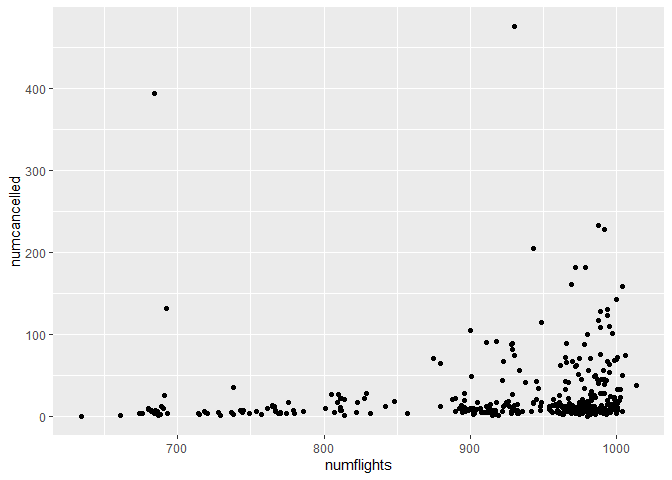<!-- -->

``` r
#delay - part 1 - correlation between delay and cancellation
cancelled_vs_delay <- flights %>%
  mutate(cancelled_flights = (is.na(dep_delay) | is.na(arr_delay))) %>%
  mutate(date = paste(month, day, year, sep = '-')) %>%
  group_by(date) %>%
  summarise(
    avg_cancelled = mean(cancelled_flights),
    avg_arr_delay = mean(arr_delay, na.rm = TRUE),
    avg_dep_delay = mean(dep_delay, na.rm = TRUE)
    ) %>%
  ungroup()

#delay - part 2 - plot to show correlation between arr_delay/dep_delay and the proportion of cancelled flights
p1 <- ggplot(cancelled_vs_delay) +
  geom_point(aes(avg_dep_delay, avg_cancelled))

p2 <- ggplot(cancelled_vs_delay) +
  geom_point(aes(avg_arr_delay, avg_cancelled))

p <- ggarrange(p1, p2, nrow = 1)

#final plot
p
```

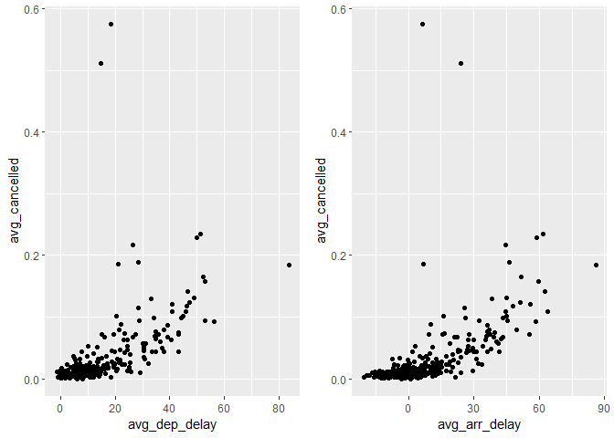<!-- --> \*\*\*

***Q2: Which flight(tailnum) has worst on-time record?***

*Solution:* The general definition of `on-time` is there is no delay in
the arrival of the flight. I filtered the flights and selected the ones
that have the `arr_time` data, because, if there is no arrival time, it
means the flight is either cancelled or departed but never arrived.
Since the `tailnum` (number of the plane) is asked to be grouped,
instead of using the `flight` number, I grouped the data by using
tailnum after filtering out the entries that do not have tailnum
available. This can be done similar to the first question using
`is.na(tailnum)`.

The worst on-time tailnum can be calculated in 2 ways since the exact
definition of on-time is not given :-

1)  **Considering all the average arr\_delay:** I calculated the number
    of flights for each tailnum and the average arrival delay for all
    the tailnums. *There are some planes (tailnum) which had less than
    100 flights while there are planes that had more than 1000 flights.
    For the comparision of best vs. worst to be fair, I calculated the
    quantiles of the count of flight using* `quantile()` *function and
    filter the flights that had flights less than 23(25th quantile).*
    Now by arranging the remaining data and looking at the first column
    would give us the top tailnum that has **highest average delay which
    is tailnum :N203FR, flights :41, avg. delay 59.12195**.

2)  **Considering only the flights that do not have any delay but
    arrived early or on-time:** (i.e arr\_delay \<=0); Hence, in part 2,
    I only considered the `arr_delay <= 0` and the rest of the summary
    is similar. With this the top flight with highest avg. delay or
    worst on-time record is **tailnum:N423AS, flights:25, avg\_delay:
    -33.44000**.

<!-- end list -->

``` r
#Q2 - Which flight(tailnum) has worst on-time record?

#general def. of on time --> flights which are not late are shown on-time

# point 1 - if we consider overall average delay

flights_ontime <- flights %>%
  mutate(date = paste(month, day, year, sep = '-')) %>%
  
  #select flights that have arrival time(means they landed)
  filter(!is.na(arr_time)) %>% 
  select(date, arr_delay, tailnum)%>%
  group_by(tailnum) %>%
  summarise(num_flights = n(),
            avg_arr_delay = mean(arr_delay, na.rm = TRUE)
            ) %>%
  filter(num_flights >= 23) %>%
  arrange(desc(avg_arr_delay))

# ans - N203FR  41  59.12195
flights_ontime
```

    ## # A tibble: 3,057 x 3
    ##    tailnum num_flights avg_arr_delay
    ##    <chr>         <int>         <dbl>
    ##  1 N203FR           41          59.1
    ##  2 N645MQ           24          51  
    ##  3 N956AT           34          47.6
    ##  4 N988AT           35          44.3
    ##  5 N521VA           27          42.2
    ##  6 N6716C           25          40.3
    ##  7 N657MQ           36          38.5
    ##  8 N942MQ           42          38.3
    ##  9 N522VA           32          37.8
    ## 10 N987AT           26          37.4
    ## # ... with 3,047 more rows

``` r
#point 2 - if we consider flights(tailnums) that are not late (i.e. avg_arr_delay <= 0)

flights_ontime <- flights %>%
  mutate(date = paste(month, day, year, sep = '-')) %>%
  
  #selecting only flights that have arrival time(means they landed)
  filter(!is.na(arr_time)) %>% 
  select(date, arr_delay, tailnum)%>%
  filter(!is.na(tailnum))%>% 
  filter(arr_delay <= 0)%>%
  group_by(tailnum) %>%
  summarise(num_flights = n(),
            avg_arr_delay = mean(arr_delay, na.rm = TRUE)
            ) %>%
  filter(num_flights >= 23) %>%
  arrange(avg_arr_delay)

flights_ontime
```

    ## # A tibble: 2,386 x 3
    ##    tailnum num_flights avg_arr_delay
    ##    <chr>         <int>         <dbl>
    ##  1 N423AS           25         -33.4
    ##  2 N388HA           26         -29.7
    ##  3 N382HA           23         -28.3
    ##  4 N402AS           29         -27.7
    ##  5 N408AS           24         -27.1
    ##  6 N384HA           24         -26.1
    ##  7 N403AS           37         -25.8
    ##  8 N419AS           25         -25.0
    ##  9 N852VA           63         -24.9
    ## 10 N4XUAA           24         -24.7
    ## # ... with 2,376 more rows

``` r
# ans - N423AS  25  -33.44000
```

-----

***Q3: What time of day should you fly if you want to avoid delays as
much as possible?***

*Solution:* To know at what time there are more delays, we can
considered only the flights that are delayed in the first place. I have
filtered only the flights that are delayed in the first place: first
remove *NA* values using `!(is.na(arr_delay)| !is.na(dep_delay))`. Then,
filter out the flights that arrived early or on time i.e there is no
delay (dep\_delay,arr\_delay \> 0). We can calculate the busiest time in
two ways: exact time or the approximate hour of the day. By grouping the
values by time, the avg. delay can be calculated. In both the methods,
*after filtering the first 25 ranked rows and observing them, it is
evident that evening times especially after 4 are the busiest hours*
where there is a lot of delay. It makes sense as with the time of the
day, the number of flights increases and with the incoming/outgoing
flights, there are higher possibilities of
delays.

``` r
#Q3 - What time of day should you fly if you want to avoid delays as much as possible?

flight_hour <- flights %>%
  mutate(date = paste(month, day, year, sep = '-')) %>%
  
  #filtering only the flights that are delayed
  filter(!is.na(dep_delay), !is.na(arr_delay)) %>%
  select(date, flight, tailnum, hour, minute, dep_delay, arr_delay) %>%
  
  #filtering only the flights that have positive delay
  filter(dep_delay > 0 & arr_delay > 0) %>%
  
  #creating time column with hour and minute
  mutate(time = paste(hour, minute, sep = ':') ) %>%
  group_by(time) %>%
  summarise(avg_delay = mean(arr_delay)) %>%
  arrange(desc(avg_delay)) %>%
  filter(min_rank(desc(avg_delay)) <= 25)

flight_hour
```

    ## # A tibble: 25 x 2
    ##    time  avg_delay
    ##    <chr>     <dbl>
    ##  1 5:58      171  
    ##  2 10:16     149. 
    ##  3 7:38      126  
    ##  4 18:48     107. 
    ##  5 22:7      105. 
    ##  6 16:9      104. 
    ##  7 16:53     103. 
    ##  8 15:51      98.5
    ##  9 12:14      95.6
    ## 10 10:27      95.2
    ## # ... with 15 more rows

``` r
# without considering minutes

flight_hour <- flights %>%
  mutate(date = paste(month, day, year, sep = '-')) %>%
  
  #filtering only the flights that are delayed
  filter(!is.na(dep_delay), !is.na(arr_delay)) %>%
  select(date, flight, tailnum, hour, minute, dep_delay, arr_delay) %>%
  
  #filtering only the flights that have positive delay
  filter(dep_delay > 0 & arr_delay > 0) %>%
  group_by(hour) %>%
  summarise(avg_delay = mean(arr_delay)) %>%
  arrange(desc(avg_delay))

flight_hour
```

    ## # A tibble: 19 x 2
    ##     hour avg_delay
    ##    <dbl>     <dbl>
    ##  1    19      61.8
    ##  2    17      60.9
    ##  3    18      59.4
    ##  4    20      58.5
    ##  5    16      58.4
    ##  6    21      56.3
    ##  7    15      52.7
    ##  8    14      52.0
    ##  9    22      51.0
    ## 10    13      46.1
    ## 11    10      45.8
    ## 12    11      44.9
    ## 13    23      43.5
    ## 14    12      43.1
    ## 15     8      43.0
    ## 16     9      42.0
    ## 17     7      38.1
    ## 18     6      37.8
    ## 19     5      26.9

``` r
# without considering positive delay
flight_hour <- flights %>%
  mutate(date = paste(month, day, year, sep = '-')) %>%
  
  #filtering only the flights that are delayed
  filter(!is.na(dep_delay), !is.na(arr_delay)) %>%
  select(date, flight, tailnum, hour, minute, dep_delay, arr_delay) %>%
  group_by(hour) %>%
  summarise(avg_delay = mean(arr_delay)) %>%
  arrange(desc(avg_delay))
flight_hour
```

    ## # A tibble: 19 x 2
    ##     hour avg_delay
    ##    <dbl>     <dbl>
    ##  1    21    18.4  
    ##  2    20    16.7  
    ##  3    19    16.7  
    ##  4    17    16.0  
    ##  5    22    16.0  
    ##  6    18    14.8  
    ##  7    16    12.6  
    ##  8    15    12.3  
    ##  9    23    11.8  
    ## 10    14     9.20 
    ## 11    13     6.54 
    ## 12    12     3.49 
    ## 13    11     1.48 
    ## 14    10     0.954
    ## 15     8    -1.11 
    ## 16     9    -1.45 
    ## 17     6    -3.38 
    ## 18     5    -4.80 
    ## 19     7    -5.30

-----

***Q4: For each destination, compute the total minutes of delay. For
each flight, compute the proportion of the total delay for its
destination.***

*Solution:* Again, I considered only the flights that have a positive
delay. Grouping by flight num and dest, I have calculated the total
minutes of delay as well as proportion of delay i.e. - `proportion =
arr_delay/total minutes of delay`.

Since there might be two same numbered flights with same destinations in
different carriers, I again calculated these values grouping by carrier
along with flight num and
destination.

``` r
#Q4 - For each destination, compute the total minutes of delay. For each flight, compute the proportion of the total delay for its destination.

total_delay <- flights %>%
  mutate(date = paste(month, day, year, sep = '-')) %>%
  filter(arr_delay > 0) %>%
  group_by(flight, dest) %>%
  select(dest, flight, arr_delay)%>%
  mutate(total_delay = sum(arr_delay),
         delay_prop = arr_delay/total_delay
         )
total_delay
```

    ## # A tibble: 133,004 x 5
    ## # Groups:   flight, dest [8,505]
    ##    dest  flight arr_delay total_delay delay_prop
    ##    <chr>  <int>     <dbl>       <dbl>      <dbl>
    ##  1 IAH     1545        11         348     0.0316
    ##  2 IAH     1714        20        1019     0.0196
    ##  3 MIA     1141        33         628     0.0525
    ##  4 ORD     1696        12          12     1     
    ##  5 FLL      507        19        1682     0.0113
    ##  6 ORD      301         8         555     0.0144
    ##  7 LAX      194         7           7     1     
    ##  8 DFW      707        31        1611     0.0192
    ##  9 ATL     4650        12        1084     0.0111
    ## 10 DTW     4401        16         718     0.0223
    ## # ... with 132,994 more rows

``` r
#if we consider carriers also:

proportion <- flights %>%
  filter(arr_delay > 0) %>%
  group_by(dest, carrier, flight) %>%
  summarise(total_delay = sum(arr_delay)) %>%
  group_by(dest) %>%
  mutate(
    prop = total_delay / sum(total_delay)
  ) %>%
  arrange(dest, desc(prop))

proportion
```

    ## # A tibble: 8,594 x 5
    ## # Groups:   dest [103]
    ##    dest  carrier flight total_delay   prop
    ##    <chr> <chr>    <int>       <dbl>  <dbl>
    ##  1 ABQ   B6        1505        2544 0.567 
    ##  2 ABQ   B6          65        1943 0.433 
    ##  3 ACK   B6        1191        1413 0.475 
    ##  4 ACK   B6        1491        1232 0.414 
    ##  5 ACK   B6        1291         267 0.0898
    ##  6 ACK   B6        1195          62 0.0208
    ##  7 ALB   EV        4309        1668 0.174 
    ##  8 ALB   EV        4271        1315 0.137 
    ##  9 ALB   EV        4117         911 0.0951
    ## 10 ALB   EV        4088         829 0.0865
    ## # ... with 8,584 more rows

-----

***Q5:Explore the distribution of each of the x, y, and z variables in
diamonds. What do you learn? Think about a diamond and how you might
decide which dimension is the length, width, and depth.***

*Solution:* **x is the length, y is the width and z is the depth of the
diamonds**. I have plotted the distributions of each of the variables
using histograms. *The distribution just shows some spikes in between
the values which might mean there are number of diamonds in the
measurement range as well as all the distributions are right skewed on
the plot*. However, we are not clearly able to see if there are any
outliers. Hence, I also plotted a *boxplot for each of the variables;
through which, we can see that there are couple of outliers for each
variable. Now, we also know the reason for the right skewedness of the
histogram plots - there are some extreme values(31, 58, etc.) while all
the other values fall below 11 or so. These values might be wrong
entries. Along with that, there are some values for x, y and z which are
falling near 0 (these might be values like 0.2, 0.4 rounded off)*. I
have also plotted the distributions without the outliers.

To know the exact values of the outliers as well as the distribution of
the variables, I have included the first few values arranged in
descending order and the summaries of each variable along with the
plots.

``` r
#Q5-Explore the distribution of each of the x, y, and z variables in diamonds. What do you learn? Think about a diamond and how you might decide which dimension is the length, width, and depth.

p11 <- ggplot(diamonds) +
  geom_histogram(mapping = aes(x), na.rm = TRUE, binwidth = 0.01)+ theme_minimal()

p12 <- ggplot(diamonds, mapping = aes(x = "", y = x))+
  geom_boxplot(na.rm = TRUE) +
  coord_flip()

p1 <- ggarrange(p11, p12, ncol = 1)

p1
```

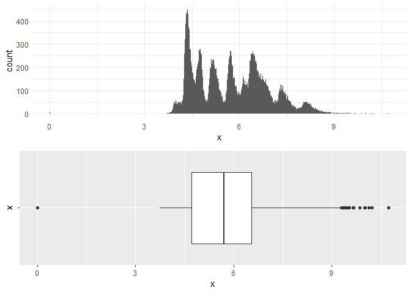<!-- -->

``` r
p21 <- ggplot(diamonds)+
  geom_histogram(mapping = aes(y), na.rm = TRUE, fill = "lightblue", binwidth = 0.01)+ theme_minimal()

p22 <- ggplot(diamonds, mapping = aes(x = "", y = y))+
  geom_boxplot(na.rm = TRUE) +
  coord_flip()+
  scale_y_continuous(limits =c(0, 60), breaks = seq(0, 60, 5))
  

p2 <- ggarrange(p21, p22, ncol = 1)

p2
```

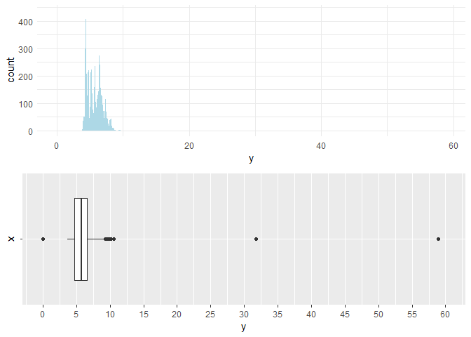<!-- -->

``` r
p31 <- ggplot(diamonds)+
  geom_histogram(mapping = aes(z), na.rm = TRUE, fill = "lightgreen", binwidth = 0.01) + theme_minimal()

p32 <- ggplot(diamonds, mapping = aes(x = "", y = z))+
  geom_boxplot(na.rm = TRUE) +
  coord_flip()+
  scale_y_continuous(limits =c(0, 40), breaks = seq(0, 40, 5))

p3 <- ggarrange(p31, p32, ncol = 1)

p3
```

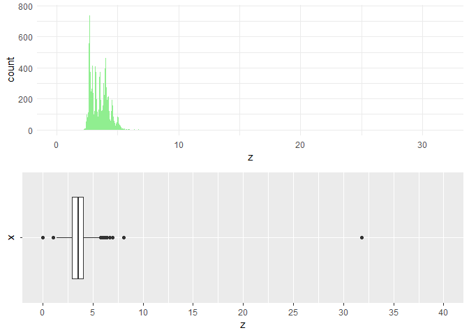<!-- -->

``` r
#x - length; y - width; z - depth

summary(select(diamonds, x, y, z))
```

    ##        x                y                z         
    ##  Min.   : 0.000   Min.   : 0.000   Min.   : 0.000  
    ##  1st Qu.: 4.710   1st Qu.: 4.720   1st Qu.: 2.910  
    ##  Median : 5.700   Median : 5.710   Median : 3.530  
    ##  Mean   : 5.731   Mean   : 5.735   Mean   : 3.539  
    ##  3rd Qu.: 6.540   3rd Qu.: 6.540   3rd Qu.: 4.040  
    ##  Max.   :10.740   Max.   :58.900   Max.   :31.800

``` r
filter(diamonds, min_rank(desc(x)) <= 3)
```

    ## # A tibble: 3 x 10
    ##   carat cut     color clarity depth table price     x     y     z
    ##   <dbl> <ord>   <ord> <ord>   <dbl> <dbl> <int> <dbl> <dbl> <dbl>
    ## 1  4.01 Premium I     I1       61      61 15223  10.1  10.1  6.17
    ## 2  5.01 Fair    J     I1       65.5    59 18018  10.7  10.5  6.98
    ## 3  4.5  Fair    J     I1       65.8    58 18531  10.2  10.2  6.72

``` r
filter(diamonds, min_rank(desc(y)) <= 3)
```

    ## # A tibble: 3 x 10
    ##   carat cut     color clarity depth table price     x     y     z
    ##   <dbl> <ord>   <ord> <ord>   <dbl> <dbl> <int> <dbl> <dbl> <dbl>
    ## 1  2    Premium H     SI2      58.9    57 12210  8.09  58.9  8.06
    ## 2  5.01 Fair    J     I1       65.5    59 18018 10.7   10.5  6.98
    ## 3  0.51 Ideal   E     VS1      61.8    55  2075  5.15  31.8  5.12

``` r
filter(diamonds, min_rank(desc(z)) <= 3)
```

    ## # A tibble: 3 x 10
    ##   carat cut       color clarity depth table price     x     y     z
    ##   <dbl> <ord>     <ord> <ord>   <dbl> <dbl> <int> <dbl> <dbl> <dbl>
    ## 1  2    Premium   H     SI2      58.9  57   12210  8.09 58.9   8.06
    ## 2  5.01 Fair      J     I1       65.5  59   18018 10.7  10.5   6.98
    ## 3  0.51 Very Good E     VS1      61.8  54.7  1970  5.12  5.15 31.8

``` r
filter(diamonds, min_rank((x)) <= 5)
```

    ## # A tibble: 8 x 10
    ##   carat cut       color clarity depth table price     x     y     z
    ##   <dbl> <ord>     <ord> <ord>   <dbl> <dbl> <int> <dbl> <dbl> <dbl>
    ## 1  1.07 Ideal     F     SI2      61.6    56  4954     0  6.62     0
    ## 2  1    Very Good H     VS2      63.3    53  5139     0  0        0
    ## 3  1.14 Fair      G     VS1      57.5    67  6381     0  0        0
    ## 4  1.56 Ideal     G     VS2      62.2    54 12800     0  0        0
    ## 5  1.2  Premium   D     VVS1     62.1    59 15686     0  0        0
    ## 6  2.25 Premium   H     SI2      62.8    59 18034     0  0        0
    ## 7  0.71 Good      F     SI2      64.1    60  2130     0  0        0
    ## 8  0.71 Good      F     SI2      64.1    60  2130     0  0        0

``` r
filter(diamonds, min_rank((y)) <= 5)
```

    ## # A tibble: 7 x 10
    ##   carat cut       color clarity depth table price     x     y     z
    ##   <dbl> <ord>     <ord> <ord>   <dbl> <dbl> <int> <dbl> <dbl> <dbl>
    ## 1  1    Very Good H     VS2      63.3    53  5139     0     0     0
    ## 2  1.14 Fair      G     VS1      57.5    67  6381     0     0     0
    ## 3  1.56 Ideal     G     VS2      62.2    54 12800     0     0     0
    ## 4  1.2  Premium   D     VVS1     62.1    59 15686     0     0     0
    ## 5  2.25 Premium   H     SI2      62.8    59 18034     0     0     0
    ## 6  0.71 Good      F     SI2      64.1    60  2130     0     0     0
    ## 7  0.71 Good      F     SI2      64.1    60  2130     0     0     0

``` r
filter(diamonds, min_rank((z)) <= 5)
```

    ## # A tibble: 20 x 10
    ##    carat cut       color clarity depth table price     x     y     z
    ##    <dbl> <ord>     <ord> <ord>   <dbl> <dbl> <int> <dbl> <dbl> <dbl>
    ##  1  1    Premium   G     SI2      59.1    59  3142  6.55  6.48     0
    ##  2  1.01 Premium   H     I1       58.1    59  3167  6.66  6.6      0
    ##  3  1.1  Premium   G     SI2      63      59  3696  6.5   6.47     0
    ##  4  1.01 Premium   F     SI2      59.2    58  3837  6.5   6.47     0
    ##  5  1.5  Good      G     I1       64      61  4731  7.15  7.04     0
    ##  6  1.07 Ideal     F     SI2      61.6    56  4954  0     6.62     0
    ##  7  1    Very Good H     VS2      63.3    53  5139  0     0        0
    ##  8  1.15 Ideal     G     VS2      59.2    56  5564  6.88  6.83     0
    ##  9  1.14 Fair      G     VS1      57.5    67  6381  0     0        0
    ## 10  2.18 Premium   H     SI2      59.4    61 12631  8.49  8.45     0
    ## 11  1.56 Ideal     G     VS2      62.2    54 12800  0     0        0
    ## 12  2.25 Premium   I     SI1      61.3    58 15397  8.52  8.42     0
    ## 13  1.2  Premium   D     VVS1     62.1    59 15686  0     0        0
    ## 14  2.2  Premium   H     SI1      61.2    59 17265  8.42  8.37     0
    ## 15  2.25 Premium   H     SI2      62.8    59 18034  0     0        0
    ## 16  2.02 Premium   H     VS2      62.7    53 18207  8.02  7.95     0
    ## 17  2.8  Good      G     SI2      63.8    58 18788  8.9   8.85     0
    ## 18  0.71 Good      F     SI2      64.1    60  2130  0     0        0
    ## 19  0.71 Good      F     SI2      64.1    60  2130  0     0        0
    ## 20  1.12 Premium   G     I1       60.4    59  2383  6.71  6.67     0

``` r
#reducing the limits

p11 <- ggplot(diamonds) +
  geom_histogram(mapping = aes(x), na.rm = TRUE, binwidth = 0.01)+ theme_minimal()+
  scale_x_continuous(limits =c(0, 10), breaks = seq(0, 10, 1))

p12 <- ggplot(diamonds, mapping = aes(x = "", y = x))+
  geom_boxplot(na.rm = TRUE) +
  coord_flip()

p1 <- ggarrange(p11, p12, ncol = 1)

p1
```

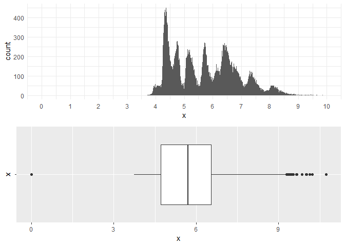<!-- -->

``` r
p21 <- ggplot(diamonds)+
  geom_histogram(mapping = aes(y), na.rm = TRUE, fill = "lightblue", binwidth = 0.01)+ theme_minimal()+
  scale_x_continuous(limits =c(0, 10), breaks = seq(0, 10, 1))

p22 <- ggplot(diamonds, mapping = aes(x = "", y = y))+
  geom_boxplot(na.rm = TRUE) +
  coord_flip()+
  scale_y_continuous(limits =c(0, 10), breaks = seq(0, 10, 2))
  

p2 <- ggarrange(p21, p22, ncol = 1)

p2
```

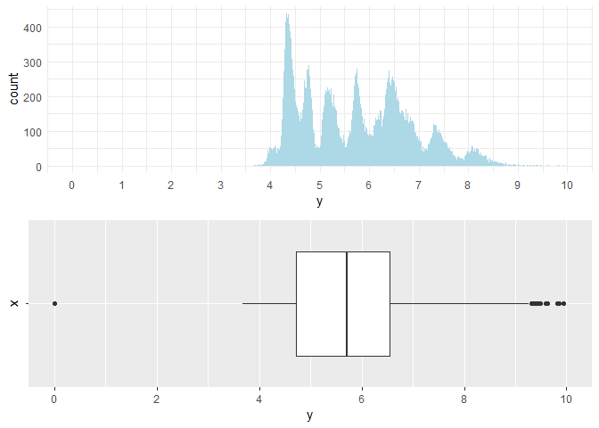<!-- -->

``` r
p31 <- ggplot(diamonds)+
  geom_histogram(mapping = aes(z), na.rm = TRUE, fill = "lightgreen", binwidth = 0.01) + theme_minimal()+
  scale_x_continuous(limits =c(0, 10), breaks = seq(0, 10, 1))

p32 <- ggplot(diamonds, mapping = aes(x = "", y = z))+
  geom_boxplot(na.rm = TRUE) +
  coord_flip()+
  scale_y_continuous(limits =c(0, 10), breaks = seq(0, 10, 2))

p3 <- ggarrange(p31, p32, ncol = 1)

p3
```

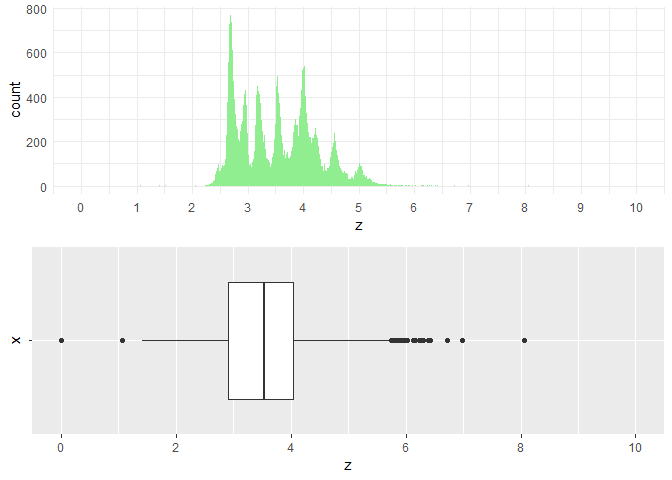<!-- -->

-----

***Q6: Explore the distribution of price. Do you discover anything
unusual or surprising? (Hint: Carefully think about the binwidth and
make sure you try a wide range of values.)***

*Solution:* I have explored the distribution of the price and number of
diamonds that fall in a give price range using histograms and trying out
multiple bin widths.

First the summary gives the distribution values - min, max, median, etc.
of the price variable. I have used binwidths of 1, 5, 10, 50 to see the
distribution of each price interval. The distribution shows that there
are lot of values that fall under around $ 8000 with peak value being
\~$ 800. After 8000, the distribution almost plateaus. So, I had set the
limit to 8000 and then the distribution is more clear. With and without
setting the limits, the distribution did not surprise me and is as
expected that there are lot of low priced diamonds while there are
comparitively less number of diamonds with high price. However, one new
observation is that there are no diamonds at all that cost \~$
1500.

``` r
#Q6 - Explore the distribution of price. Do you discover anything unusual or surprising? (Hint: Carefully think about the binwidth and make sure you try a wide range of values.)

summary(select(diamonds, price))
```

    ##      price      
    ##  Min.   :  326  
    ##  1st Qu.:  950  
    ##  Median : 2401  
    ##  Mean   : 3933  
    ##  3rd Qu.: 5324  
    ##  Max.   :18823

``` r
price1 <- ggplot(diamonds)+
  geom_histogram(aes(price), na.rm = TRUE, binwidth = 1)+
  scale_x_continuous(limits =c(0, 20000), breaks = seq(0, 20000, 2000))

price1
```

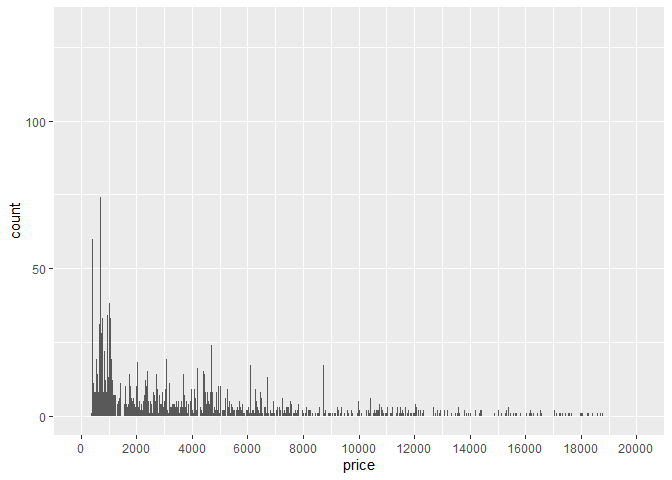<!-- -->

``` r
price2 <- ggplot(diamonds)+
  geom_histogram(aes(price), na.rm = TRUE, binwidth = 5)+
  scale_x_continuous(limits =c(0, 20000), breaks = seq(0, 20000, 2000))

price2 
```

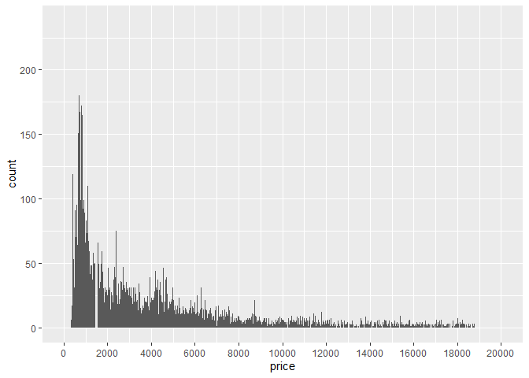<!-- -->

``` r
price3 <- ggplot(diamonds)+
  geom_histogram(aes(price), na.rm = TRUE, binwidth = 10)+
  scale_x_continuous(limits =c(0, 20000), breaks = seq(0, 20000, 2000))

price3 
```

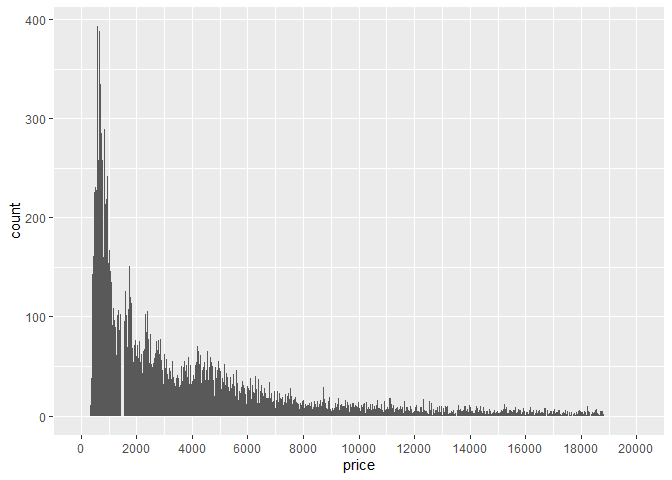<!-- -->

``` r
price4 <- ggplot(diamonds)+
  geom_histogram(aes(price), na.rm = TRUE, binwidth = 50)+
  scale_x_continuous(limits =c(0, 20000), breaks = seq(0, 20000, 2000))

price4 
```

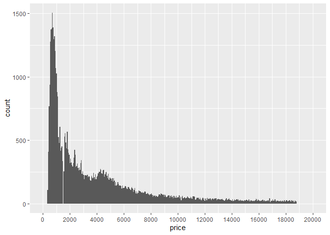<!-- -->

``` r
price5 <- ggplot(diamonds)+
  geom_histogram(aes(price), na.rm = TRUE, binwidth = 50)+
  scale_x_continuous(limits =c(0, 8000), breaks = seq(0, 8000, 2000))

price5
```

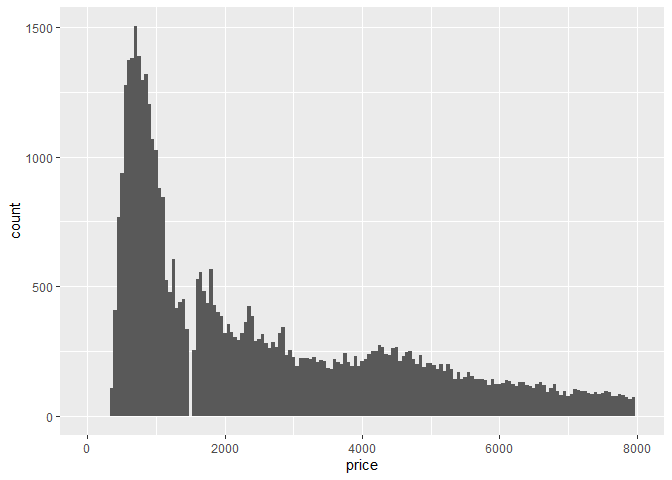<!-- -->

``` r
price6 <- ggplot(diamonds)+
  geom_histogram(aes(price), na.rm = TRUE, binwidth = 50)+
  scale_x_continuous(limits =c(0, 3000), breaks = seq(0, 3000, 300))

price6
```

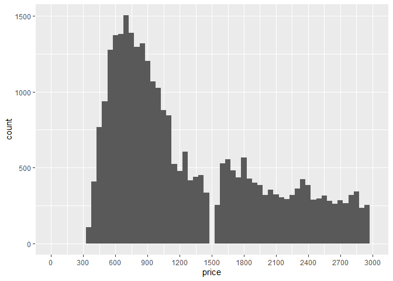<!-- -->

-----

***Q7: How many diamonds are 0.99 carat? How many are 1 carat? What do
you think is the cause of the difference? ***

*Solution:* The carat number of a diamond measures the weight of the
diamond. Each number is divided into 100 parts for precision of the
carat number. Carat is a major factor that decides the price of the
diamond along with cut, color etc. There are **23 diamonds with 0.99
carat and 1558 diamonds with 1.0 carat**. As of my knowledge, this
number difference may be because 1 is a more popular carat size which
allows you to get a good enough quality diamond as well as the number is
rounded off. *We can see the drastice chang of price too from 0.99 to
1.0* in the table below. We might also assume from this table that the
price range is increasing around the rounded off numbers. However, this
might be a biased assumption using price as other factors like cut,
clarity and color can also cause the price
change.

``` r
#Q7- How many diamonds are 0.99 carat? How many are 1 carat? What do you think is the cause of the difference?

carat <- diamonds %>%
  filter(carat == 0.99 | carat == 1) %>%
  group_by(carat) %>%
  summarise(count_0.99 = n())
carat
```

    ## # A tibble: 2 x 2
    ##   carat count_0.99
    ##   <dbl>      <int>
    ## 1  0.99         23
    ## 2  1          1558

``` r
carat_price <- diamonds %>%
  group_by(carat) %>%
  summarise(count = n(),
            min_price = min(price),
            max_price = max(price),
            avg_price = mean(price)
            ) %>%
  arrange(carat)
carat_price
```

    ## # A tibble: 273 x 5
    ##    carat count min_price max_price avg_price
    ##    <dbl> <int>     <int>     <int>     <dbl>
    ##  1 0.2      12       345       367      365.
    ##  2 0.21      9       326       394      380.
    ##  3 0.22      5       337       470      391.
    ##  4 0.23    293       326       688      486.
    ##  5 0.24    254       336       963      505.
    ##  6 0.25    212       357      1186      551.
    ##  7 0.26    253       337       814      551.
    ##  8 0.27    233       361       893      575.
    ##  9 0.28    198       360       828      580.
    ## 10 0.290   130       334      1776      601.
    ## # ... with 263 more rows

``` r
smallset <- carat_price %>%
  filter(carat >= 0.9, carat <= 1)
smallset
```

    ## # A tibble: 11 x 5
    ##    carat count min_price max_price avg_price
    ##    <dbl> <int>     <int>     <int>     <dbl>
    ##  1  0.9   1485      1599      9182     3939.
    ##  2  0.91   570      1570      9636     3981.
    ##  3  0.92   226      2283      7544     4035.
    ##  4  0.93   142      2374      5992     3994.
    ##  5  0.94    59      2571      7120     4196.
    ##  6  0.95    65      2195      6951     4014.
    ##  7  0.96   103      1637      6807     3623.
    ##  8  0.97    59      1547      7415     4026.
    ##  9  0.98    31      1712      4950     3470.
    ## 10  0.99    23      1789      6094     4406.
    ## 11  1     1558      1681     16469     5242.

-----

***Q8: What variable in the diamonds dataset is most important for
predicting the price of a diamond? How is that variable correlated with
cut? Why does the combination of those two relationships lead to lower
quality diamonds being more expensive?***

*Solution:* To determine what variable is most important in predicting
the price, we can explore the distributions of each variable. As carat
is measured from the dimensions of the diamond, we can just consider
carat, cut, color, clarity as the factors that effect the price of the
diamond. The following discusses the distributions of each variable.

  - *Carat:* I have created a hex plot to see the covariation of price
    and carat. It is **very evident that the increase in carat directly
    increases the price of the diamonds**. As suggested in the R for DS
    guide, since the scatter or hex plot is very crowded, I have created
    binned boxplot chart to see the variation of price range and carats
    range.

  - *Cut*: The box plot of cut vs. price shows that there is not much
    variation in the price. In fact, the distribution is negative at one
    point - where the cut is ideal(best), the price is least. This can
    be because rather than the cut, as carat gives the weight of the
    diamond, cut doesn’t effect the price much. The average price range
    of the fair ones is higher than the ideal ones.

  - *Color:* **The color quality of the diamond is calculated as D -
    best, J - worst**. Therefore, it is clear that the variation is
    again negative i.e. the price decreases as the color quality
    increases.

  - *Clarity:* The price does not vary much with the clarity. At few
    levels it is positive but **as the clarity value increases, the
    price decreased eventually.**

***Therefore, Carat is the major factor that majorly affects the price
of the diamond.***

**Correlation between carat and cut:** From the plot, which shows the
distribution of the carat vs. cut, more higher carat diamonds are in the
lower cut range of the diamonds.

The combination of these two can lead to lower quality diamonds in such
a way that even though the cut of diamonds is not ideal, since the carat
is determined by the dimensions of the diamond, the increase in carat
number means the diamond is bigger. This results in the higher price
even though other attributes such as cut, clarity, etc. are of lower
quality.

``` r
#Q8 -  What variable in the diamonds dataset is most important for predicting the price of a diamond? How is that variable correlated with cut? Why does the combination of those two relationships lead to lower quality diamonds being more expensive?
# Carat of the diamond is measured from the dimensions of the diamond. Hence, the other variables cut, color, clarity along with carat can be considered as the factors that effect the price of the diamond.

#Correlation between each variable and price

#2 continuous variables - scatter/hex/box plots

#1 Carat
price_vs_carat1 <- ggplot(diamonds)+
  geom_hex(aes(carat, price))

price_vs_carat1
```

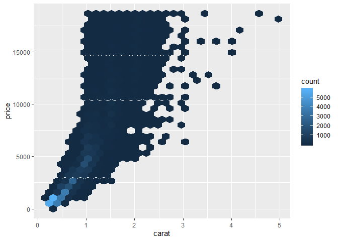<!-- -->

``` r
#hard to see - try boxplot

price_vs_carat2 <- ggplot(diamonds, aes(carat, price))+
  geom_boxplot(aes(group = cut_width(carat, 0.1)))

price_vs_carat2
```

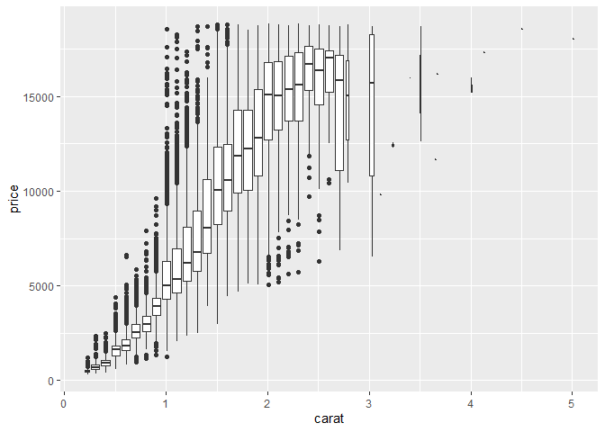<!-- -->

``` r
#2 - Cut1
#one cont. one categorical
price_vs_cut <- ggplot(data = diamonds, mapping = aes(x = cut, y = price)) +
  geom_boxplot()

price_vs_cut
```

<!-- -->

``` r
#freq. poly.
price_vs_cut1 <- ggplot(data = diamonds, mapping = aes(x = price, y = ..density..)) + 
  geom_freqpoly(mapping = aes(colour = cut), binwidth = 500)

price_vs_cut1
```

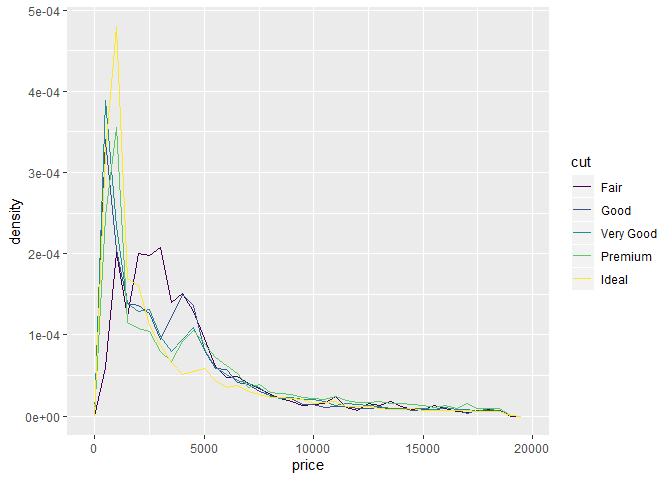<!-- -->

``` r
#3 - Color
#categorical and cont.

#boxplot
price_vs_color2 <- ggplot(diamonds)+
  geom_boxplot(aes(color, price))

price_vs_color2
```

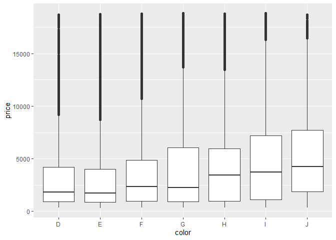<!-- -->

``` r
#price increasing as the color - quality worsens

#4- Clarity

price_vs_clarity <- ggplot(diamonds)+
  geom_boxplot(aes(clarity, price))

price_vs_clarity
```

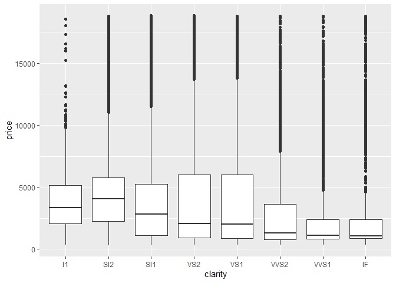<!-- -->

``` r
#5 - carat vs. cut

# 2 categorical variables

carat_cut <- ggplot(diamonds)+
  geom_boxplot(aes(cut, carat))+coord_flip()

carat_cut
```

<!-- -->

-----

***Extra Credit: Install the ggstance package, and create a horizontal
boxplot. How does this compare to using coord\_flip()?***

*Solution:* By using the `ggstance` package, *the horizontal box plot
can be simply created using* `geom_boxploth()` *and flipping the
variable assigned to the axes.* - (so, just a letter ‘h’ is added at the
end of geom\_boxplot instead of `coord_flip()`). The result is similar.

``` r
#Extracredit
#coord_flip()
carat_cut <- ggplot(diamonds)+
  geom_boxplot(aes(cut, carat))+
  coord_flip()

carat_cut
```

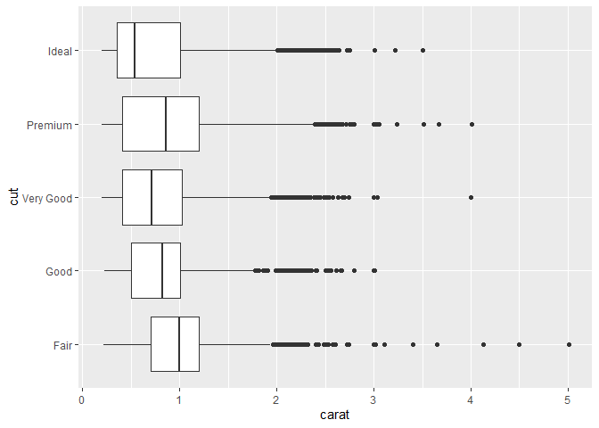<!-- -->

``` r
#ggstance

carat_cut2 <- ggplot(diamonds)+
  geom_boxploth(aes(carat, cut))

carat_cut2
```

<!-- -->

-----

***Q9:How could you rescale the count dataset above to more clearly show
the distribution of cut within colour, or colour within cut?***

*Solution:* To calculate *Cut within Color*, the number of diamonds
belonging to each cut within each color is calculated; to better
represent it instead of count, it is scaled to density and plotted. The
colour scale in the legend represents the density values. Similary, the
*Color within Cut* is also calculated and represented. The rescaled
plots and tables are as
follows.

``` r
#Q9 - How could you rescale the count dataset above to more clearly show the distribution of cut within colour, or colour within cut?

#given
count_dataset <- diamonds %>% 
  count(color, cut)
count_dataset 
```

    ## # A tibble: 35 x 3
    ##    color cut           n
    ##    <ord> <ord>     <int>
    ##  1 D     Fair        163
    ##  2 D     Good        662
    ##  3 D     Very Good  1513
    ##  4 D     Premium    1603
    ##  5 D     Ideal      2834
    ##  6 E     Fair        224
    ##  7 E     Good        933
    ##  8 E     Very Good  2400
    ##  9 E     Premium    2337
    ## 10 E     Ideal      3903
    ## # ... with 25 more rows

``` r
#rescaling from count to proportion/density

# Cut within colour
rescale_cutWcol <- diamonds %>%
  count(color, cut)%>%
  group_by(cut)%>%
  mutate(density = n/sum(n))

rescale_cutWcol
```

    ## # A tibble: 35 x 4
    ## # Groups:   cut [5]
    ##    color cut           n density
    ##    <ord> <ord>     <int>   <dbl>
    ##  1 D     Fair        163   0.101
    ##  2 D     Good        662   0.135
    ##  3 D     Very Good  1513   0.125
    ##  4 D     Premium    1603   0.116
    ##  5 D     Ideal      2834   0.132
    ##  6 E     Fair        224   0.139
    ##  7 E     Good        933   0.190
    ##  8 E     Very Good  2400   0.199
    ##  9 E     Premium    2337   0.169
    ## 10 E     Ideal      3903   0.181
    ## # ... with 25 more rows

``` r
cutWcol <- ggplot(rescale_cutWcol)+
  geom_tile(aes(color, cut, fill = density))+
  scale_fill_distiller(palette = "RdYlBu", limits = c(0,1))

cutWcol
```

<!-- -->

``` r
# Colour within cut
rescale_colWcut <- diamonds %>%
  count(color, cut)%>%
  group_by(color)%>%
  mutate(density = n/sum(n))

rescale_colWcut
```

    ## # A tibble: 35 x 4
    ## # Groups:   color [7]
    ##    color cut           n density
    ##    <ord> <ord>     <int>   <dbl>
    ##  1 D     Fair        163  0.0241
    ##  2 D     Good        662  0.0977
    ##  3 D     Very Good  1513  0.223 
    ##  4 D     Premium    1603  0.237 
    ##  5 D     Ideal      2834  0.418 
    ##  6 E     Fair        224  0.0229
    ##  7 E     Good        933  0.0952
    ##  8 E     Very Good  2400  0.245 
    ##  9 E     Premium    2337  0.239 
    ## 10 E     Ideal      3903  0.398 
    ## # ... with 25 more rows

``` r
colWcut <- ggplot(rescale_colWcut)+
  geom_tile(aes(color, cut, fill = density))+
  scale_fill_distiller(palette = "RdYlBu", limits = c(0,1))

colWcut
```

<!-- -->

-----

***Q10:Use geom\_tile() together with dplyr to explore how average
flight delays vary by destination and month of year. What makes the plot
difficult to read? How could you improve it?***

*Solution:* I have used `geom_tile()` with the dplyr for `arr_delay` and
`dep_delay` and plotted it. The plots are difficult to read:

  - Because of the color scaling,
  - There are lot of empty values,
  - The plot is congested as there are several number of values.

These can be fixed by changing the *scale of the color using palettes*
from the color brewer. This is one option. There are multiple others
available. The empty block are present either because *the values are NA
or there are some destinations which did not have flight every month*;
this can be fixed by taking only the destinations which had flights
every single month using `n() == 12`. Now the plots look better. *By
adjusting the height of the plot, the plot looks a little congested and
the names of the destinations are readable on the
y-axis*.

``` r
#Q10- Use geom_tile() together with dplyr to explore how average flight delays vary by destination and month of year. What makes the plot difficult to read? How could you improve it?

plot1 <- flights %>%
  select(year, month, day, dest, dep_delay, arr_delay)%>%
  group_by(month, dest)%>%
  summarise(avg_dep_delay = mean(dep_delay, na.rm = TRUE),
            avg_arr_delay = mean(arr_delay, na.rm = TRUE))

plot_dep <- ggplot(plot1)+
  geom_tile(aes(factor(month), dest, fill = avg_dep_delay))

plot_dep
```

<!-- -->

``` r
plot_arr <- ggplot(plot1)+
  geom_tile(aes(factor(month), dest, fill = avg_arr_delay))

plot_arr
```

<!-- -->

``` r
#improvise

improvise <- flights %>%
  select(year, month, dest, dep_delay, arr_delay) %>%
  filter(!is.na(arr_delay), !is.na(dep_delay)) %>%
  group_by(month, dest)%>%
  filter(dep_delay > 0, arr_delay > 0) %>%
  summarise(avg.dep.delay = mean(dep_delay, na.rm = TRUE), 
            avg.arr.delay = mean(arr_delay, na.rm = TRUE)
            ) %>%
  ungroup() %>%
  group_by(dest) %>%
  filter(n() == 12)
  
#view(improvise)

p1 <- ggplot(improvise) +
  geom_tile(aes(factor(month), dest, fill = avg.arr.delay))+
  scale_fill_distiller(palette = "RdYlGn")+
  xlab("month") + ylab("destination") +
  ggtitle(label = "Arrival Delay")
  
p1
```

<!-- -->

``` r
p2 <- ggplot(improvise) +
  geom_tile(aes(factor(month), dest, fill = avg.dep.delay)) +
  scale_fill_distiller(palette = "RdYlGn") +
  xlab("month") + ylab("destination")

p2
```

<!-- -->

\***Extra credit: Q11 - Instead of summarising the conditional
distribution with a boxplot, you could use a frequency polygon. What do
you need to consider when using cut\_width() vs cut\_number()? How does
that impact a visualisation of the 2d distribution of carat and price?**

*Solution:* Cut\_width and Cut\_number can also be used with to
construct a frequency-ploygon. Adjusting the `cut_width` is similar to
using the `binwidth` and `cut_number` is similar to `bins` argument. The
width is given by us in the cut\_width and the width is determined by
the the number of bins we choose in the cut\_number. We have to be
careful in chosing either of those; similar to binwidth or bin number,
we need to explore multiple options and pick the right numbers; as
picking higher or lower numbers would not let us see the distribution
clearly and get some useful/new
insights.

``` r
#Q11 - Instead of summarising the conditional distribution with a boxplot, you could use a frequency polygon. What do you need to consider when using cut_width() vs cut_number()? How does that impact a visualisation of the 2d distribution of carat and price?

cutnumber <- ggplot(data = diamonds) + 
  geom_freqpoly(aes(color = cut_number(carat, 5), x = price)) + 
  labs(color = "Carat")

cutnumber
```

<!-- -->

``` r
cutwidth <- ggplot(diamonds)+
  geom_freqpoly(aes(price, color = cut_width(carat, 1.5, boundary = 0))) +
  labs(color = "Carat")

cutwidth
```

<!-- -->

***Extra credit: Q12:Visualise the distribution of carat, partitioned by
price.***

*Solution:* The price can be partitioned using `cut_number` from the
`dplyr` package. This partitions the price value intervals. Here, I
chose 10. And, hence there are 10 ticks of price on the y-axis.

``` r
#Q12 -  Visualise the distribution of carat, partitioned by price.

#Carat, price - 2 cont. 

#scatter/box
#too many vars/ can't show distribution using scatterplot

distribution <- ggplot(diamonds)+
  geom_boxploth(aes(carat, cut_number(price, 10)))+
  labs(y = "Price", x = "Carat")

distribution
```

<!-- -->

***Extra credit: Q13: How does the price distribution of very large
diamonds compare to small diamonds? Is it as you expect, or does it
surprise you? ***

*Solution:* The variables x, y, z, depth and carat determines the
dimensions of the diamond. We can see from the following tables that the
price increases with the increase in x, y, z and depth values of the
diamond. In fact, the price is highes with the increase in the values of
these variables, even though the carat number which determines the
weight is around the median.

It is as I expected and did not surprise me since it is known from
multiple previous questions here and personal knowledge that the size of
the diamond directly effects the price of the
diamond.

``` r
#Q13 - How does the price distribution of very large diamonds compare to small diamonds? Is it as you expect, or does it surprise you?

price_distribution <- diamonds %>%
  arrange(desc(price)) %>%
  select(carat, depth, price, x, y, z)
price_distribution
```

    ## # A tibble: 53,940 x 6
    ##    carat depth price     x     y     z
    ##    <dbl> <dbl> <int> <dbl> <dbl> <dbl>
    ##  1  2.29  60.8 18823  8.5   8.47  5.16
    ##  2  2     63.5 18818  7.9   7.97  5.04
    ##  3  1.51  61.7 18806  7.37  7.41  4.56
    ##  4  2.07  62.5 18804  8.2   8.13  5.11
    ##  5  2     62.8 18803  7.95  8     5.01
    ##  6  2.29  61.8 18797  8.52  8.45  5.24
    ##  7  2.04  58.1 18795  8.37  8.28  4.84
    ##  8  2     60.8 18795  8.13  8.02  4.91
    ##  9  1.71  62.3 18791  7.57  7.53  4.7 
    ## 10  2.15  62.6 18791  8.29  8.35  5.21
    ## # ... with 53,930 more rows

``` r
summary(select(diamonds, price, carat, depth, x, y, z))
```

    ##      price           carat            depth             x         
    ##  Min.   :  326   Min.   :0.2000   Min.   :43.00   Min.   : 0.000  
    ##  1st Qu.:  950   1st Qu.:0.4000   1st Qu.:61.00   1st Qu.: 4.710  
    ##  Median : 2401   Median :0.7000   Median :61.80   Median : 5.700  
    ##  Mean   : 3933   Mean   :0.7979   Mean   :61.75   Mean   : 5.731  
    ##  3rd Qu.: 5324   3rd Qu.:1.0400   3rd Qu.:62.50   3rd Qu.: 6.540  
    ##  Max.   :18823   Max.   :5.0100   Max.   :79.00   Max.   :10.740  
    ##        y                z         
    ##  Min.   : 0.000   Min.   : 0.000  
    ##  1st Qu.: 4.720   1st Qu.: 2.910  
    ##  Median : 5.710   Median : 3.530  
    ##  Mean   : 5.735   Mean   : 3.539  
    ##  3rd Qu.: 6.540   3rd Qu.: 4.040  
    ##  Max.   :58.900   Max.   :31.800

***Extra credit: Q14: Combine two of the techniques you’ve learned to
visualise the combined distribution of cut, carat, and price.***

*Solution:* The following are the 2 plots I have created using 2
techniques - boxplot and hexbin. Each one compares the carat, cut and
price of the
diamonds.

``` r
#Q14 - Combine two of the techniques you’ve learned to visualise the combined distribution of cut, carat, and price.

technique_boxplot <- ggplot(diamonds, aes(x = cut_width(carat, 0.8), y = price, colour = cut))+
  geom_boxplot()

technique_boxplot
```

<!-- -->

``` r
technique_hexbin <- ggplot(diamonds)+
  geom_hex(aes(carat, price, fill = cut), alpha = 1/3, na.rm = TRUE)+
  scale_y_continuous(limits = c(0, 20000), breaks = seq(0, 20000, 2000))

technique_hexbin
```

<!-- -->

***Extra credit: Q15: Two dimensional plots reveal outliers that are not
visible in one dimensional plots. For example, some points in the plot
below have an unusual combination of x and y values, which makes the
points outliers even though their x and y values appear normal when
examined separately. … Why is a scatterplot a better display than a
binned plot for this case? ***

*Solution:* Even though 2D plots reveal outliers that are not visible in
1D plots, in this case, scatter plot reveals the exact direct
correlation bewteen x and y which is not determined by the boxplot.
Sure, we can see the exact outliers unlike the scatter plot - which
shows some outliers which are actually not
outliers.

``` r
#Q15 - Two dimensional plots reveal outliers that are not visible in one dimensional plots. For example, some points in the plot below have an unusual combination of x and y values, which makes the points outliers even though their x and y values appear normal when examined separately. ... Why is a scatterplot a better display than a binned plot for this case? 

binned_boxplot <- ggplot(diamonds)+
  geom_boxploth(aes(x, cut_width(y, 1.5)))

binned_boxplot
```

<!-- -->

``` r
scatterplot <- ggplot(data = diamonds) +
  geom_point(mapping = aes(x = x, y = y)) +
  coord_cartesian(xlim = c(4, 11), ylim = c(4, 11))

scatterplot
```

<!-- --> \*\*\*

### References:

I have not used any references except for the [R for DS guide - Ch5 and
Ch7](https://r4ds.had.co.nz/). This was good enough for me to understand
and answer these questions.
