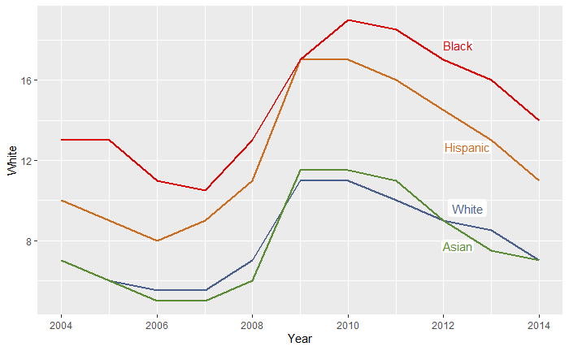
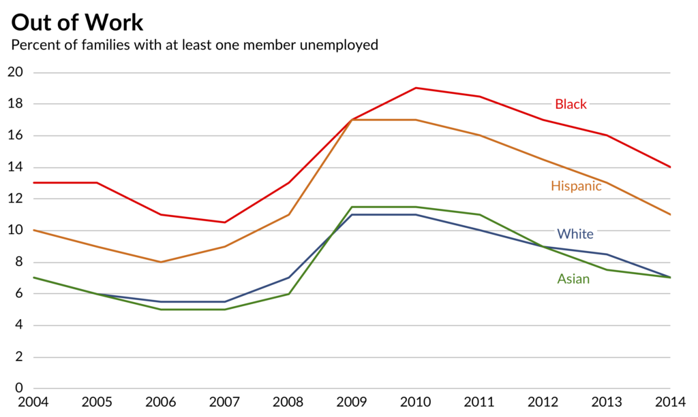
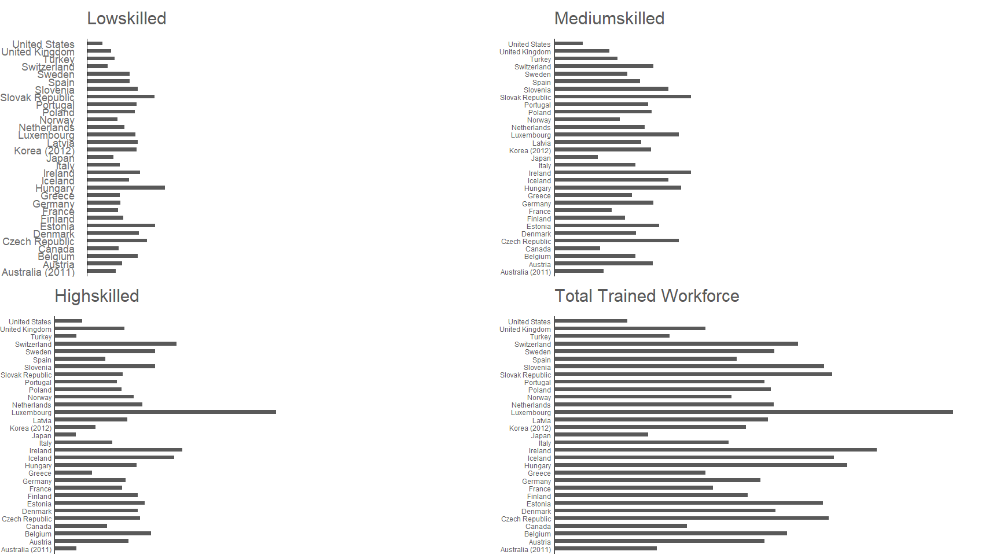
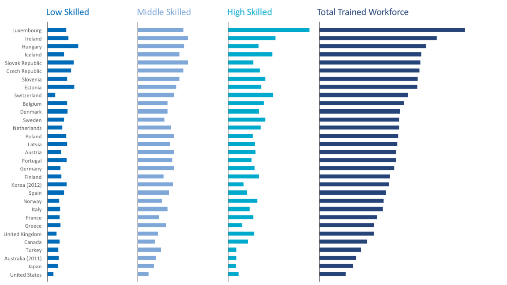

CS 625, Fall 2019

```{r setup, include=FALSE, collapse = TRUE}
options(width = 80)
knitr::opts_chunk$set(echo = TRUE, tidy = TRUE)
```

---

I have used **R** tool to recreate the charts for this homework. As I have already worked in R for the previous assignment, I wanted to explore more options regarding customising charts through this. I chose the **first chart-WSJ from Part 1** by default and the **OECD chart from Part 2** as it intrigued me. The following sections explain how I recreated these charts using *ggplot in R*.

#### Plot 1 from part 1:

My first step, as always, was to load the basic required libraries like `tidyverse`, `ggplot2` to create the plot. While creating the plots, I kept adding more required libraries to make necessary adjustments in matching the charts. I included the libraries like `reshape2` and `lubridate` that help in transforming the data as I did not want to modify manually in excel but through R. To match the fonts, I have installed `extrafont` package and it loads all the fonts available in the windows. 

The data for this plot is provided in an excel sheet and it was pretty direct with 5 columns - 1 for years and 4 for the ethnicity groups. All I had to do was add a name `Year` to the first column col.no.1 in R using `colnames()` function. 

List of libraries I have included: 

```{r libraries, include=FALSE}
library(tidyverse)
library(ggplot2)
library(dplyr)
library(XLConnect) 
library(directlabels)
library(extrafont)
require(ggthemes)
library(reshape2)
library(lubridate)
library(ggpubr)
```

To load this excel sheet into R, I loaded `XLConnect` library through which we can directly read the required worskheets, columns, rows, etc using `readWorksheetFromFile()` function. As soon as I saw the data, I realised that there are *2 ways to create this plot*:

1) To create a plot with one line for one group and keep adding more lines for the rest of the groups.

2) To transform the data into 3 columns with variables(ethnicity groups), values and plot it directly. I have included the codes for both the ways in this report.

Here, ***for the first method***, I have created a base  `plot p` using `ggplot() and geom_line()` with one line and added other group lines to it.  `Colorzilla` is an extension on Google Chrome which allows us to pick a color on a webpage. I used it to get the colors for marks, text, and other components of both the plots I have recreated. Now, the first plot I recreated has a label at the end of each line instead of a common legend. This can be accomplished using `geom_label()` and it also allows us to adjust the position, justification, color, etc. of the labels (to match the existing plot). 

A basic plot like this is created with all the lines in it:



The next step was to adjust the axis labels and the background theme of the plot. The package [ggthemes](https://yutannihilation.github.io/allYourFigureAreBelongToUs/ggthemes/) adds more theme options to R and I have used `theme_hc() - highcharts` from this package to get the similar background of the chart I was recreating. `scale_x\y_continuous\discrete` allows us to customise the axis limits, breaks, labels, etc. And, by default, ggplot creates plots with some axis range before the first tick. This can also be adjusted using `expand` argument in the `scale_x_continuous`. Using `theme()`, I have customised multiple other text and colour components of the plot.

Now, the chart almost looks like the one I am trying to recreate. However, the only thing I was not able to match was having smoother line marks. The lines are a little jagged. I have played around with `geom_smooth()` but, I realised that it cannot be accomplished using this function. As well as, I need to look up more on other ways to label these lines. I tried `directlabels` package but I got a better result here with `geom_label()`. The following is the r code I used and the resulting plot:  


##### Chart 1 from Part 1

```{r Chart 1}
#read sheet from file
sheet1 <- readWorksheetFromFile("WSJ.xlsx", sheet = 1, endCol = 5)

#change name of column 1 to 'Year'
colnames(sheet1)[colnames(sheet1) == "Col1"] <- "Year"

#White line
p <- ggplot(sheet1, aes(x = Year))

p <- p + 
  geom_line(aes(y = White), color = "#495E8A", size = 1.05, linetype = "solid")+
  geom_label(aes(y = White[9], x = Year[9] + 0.5, label = "White"), color = "#495E8A", vjust = -0.2, fill = "white", label.size = NA)

#Hispanic line
p <- p + 
  geom_line(aes(y = Hispanic), color  = "#CA6D20", size = 1.05)+
  geom_label(aes(y = Hispanic[9], x = Year[9] + 0.5, label = "Hispanic"), color = "#CA6D20", vjust = 2.8, label.padding = unit(0.07, "lines"), label.size = NA)

#Asian line
p <- p + 
  geom_line(aes(y = Asian), color = "#5B8C35", size = 1.05)+
  geom_label(aes(y = Asian[9], x = Year[9] + 0.3, label = "Asian"), color = "#5B8C35", vjust = 2.5, fill = "white", label.padding = unit(0.1, "lines"), label.size = NA)
  
#Black line
p <- p + 
  geom_line(aes(y = Black), color = "#DB0404", size = 1.05)+
  geom_label(aes(y = Black[9], x = Year[9] + 0.3, label = "Black"), color = "#DB0404", vjust = -0.8, fill = "white", label.padding = unit(0.08, "lines"), label.size = NA)

#Setting axis breaks
p <- p + theme_hc()+
  scale_x_continuous(name="", breaks = seq(2004, 2014, 1), expand = c(0,0.3))+
  scale_y_continuous(name="", limits = c(0,20), breaks = seq(0, 20, 2))

#changing axis text size and removing axis ticks
p <- p + 
  theme(axis.text.x = element_text(size = rel(1.3), family = "Calibri", color = "black"), axis.text.y = element_text(size = rel(1.3), family = "Calibri", color = "black"), axis.ticks =element_blank(), plot.margin = margin(0, 0, 0, 0, "cm"))


#Adding plot title and subtitle
p <- p + 
  labs(title = "Out of Work", subtitle = "Percent of families with at least one member unemployed")+ 
  theme(plot.title = element_text(family = "Calibri", size = 18, face = "bold", vjust = 0, hjust = -0.04), plot.subtitle = element_text(family = "Calibri", size = 13, hjust = -0.09))


#final plot
p
  
```

**To compare the chart I created with the actual remake line chart from the PolicyViz website; here is the image:**



The result chart created using ***second method*** looks similar too. To create this chart, I transformed the data using `melt()` function from the `lubridate` and `reshape2` packages and plotted a line chart using `ggplot` and `geom_line()`. The customization of the rest of the plot components was similar to the first method. 

The code I used for the second method and the resulting plot is:      

```{r Chart 1 - method 2}
sheet1 <- readWorksheetFromFile("WSJ.xlsx", sheet = 1, endCol = 5)

#change name of column 1 to 'Year'
colnames(sheet1)[colnames(sheet1) == "Col1"] <- "Year"

new1 <- melt(sheet1[, c ('Year','White','Hispanic','Asian','Black')], value.name = "value", id.vars = 1 )

names(new1) <-  c("Year", "Class", "Value")

g <- ggplot(new1, aes(x = Year, y = Value)) +
  geom_line(aes(color = Class), size = 1, show.legend = FALSE)

g <- g + scale_color_manual(values = c("White" = "#495E8A", "Hispanic" = "#CA6D20", "Asian" = "#5B8C35" , "Black" = "#DB0404"))

g <- g+ labs(title = "Out of Work", subtitle = "Percent of families with at least one member unemployed")+ 
  theme(plot.title = element_text(family = "Calibri", face = "bold", size = 18, vjust = 0, hjust = -0.04), plot.subtitle = element_text(family = "Calibri", size = 13, hjust = -0.09))

g <- g + theme(axis.text.x = element_text(size  = rel(1.3), family = "Calibri", color = "black"), axis.text.y = element_text(size = rel(1.3), family = "Calibri", color = "black"), axis.ticks =element_blank(), plot.margin = margin(0, 0, 0, 0, "cm"))

g <- g + theme_hc() +
  scale_x_continuous(name="", breaks = seq(2004, 2014, 1), expand = c(0,0.3))+
  scale_y_continuous(name="", limits = c(0,20), breaks = seq(0, 20, 2))
  
g 

```

----------------
#### Plot 2 from part 2:

I loaded the excel worksheet and renamed the columns as required similar to the first part. The data for this chart was also straight forward and did not require any transformation. 

My initial plan to create this chart was creating 4 plots and arranging them all in a single plot using `ggarrange()` from the `ggpubr` package. This resulted in a pretty matched chart and I did not have to look for other methods to accomplish this. 

The method to create this chart was a little similar to the method 1 for part 1. I have created a base plot B which customises the common components like theme, axis scale etc. for the 4 small multiples. Then, I created bar charts B1, B2, B3, B4 for each of the 4 groups using `geom_bar()`. 

After arranging small multiples and before a lot of customisation, the plot looked like this: 



In ggplot, the marks are ordered by default either alphabetically or sorted by values. Here, I used **`factor()`** *to preserve the order* of the attribute as given in the data frame. Customisation of theme, plot colors, font - color and axis was similar to the first plot using `scale_x\y_continuous()` and `theme()` options. Adjusting the margins using `margin()` as well as the colors of various components were the most important tasks in recreating this plot. Using `ggarrange()`, I have joined all the plots on a single page. Setting the `nCol` argument value brings all the plots in a single row. There are number of packages or methods like `cowplot()`, `gridExtra`, etc. available for the arrangement of multiple plots on a single page or as desired. However, `ggarrange()` seemed perfect for this task and the output was as needed.      

One thing I noticed in the given remake chart was that the scale on y axis for the values was not consistent. For the first 3 groups, the author used a filler equals to 50 and hence the overall scale was 50 for the first 3 charts. For the last one, the scale was the highest value(~88). I wanted to see how the chart looks if the scale was common for all the multiples and hence, I used limits 0 to 90 for all the 4 groups. 

Here is the code and output plot with a ***common scale*** for all the multiples:  

##### Chart 1 from Part 2 

```{r Part 2 - way1, fig.width = 18, fig.height = 10} 
#read worksheet
Sheet2 <- readWorksheetFromFile("OECD_Skills.xlsx", sheet = 1, endCol = 7, startRow = 13, endRow = 44, header = TRUE)

#rename the columns
names(Sheet2) <- c("Coun", "Country", "Highskilled", "Mediumskilled", "Lowskilled", "Total", "Total business sector employment sustained by foreign demand")

#preserve the dataframe order
Sheet2$Country <- factor(Sheet2$Country, levels = rev(Sheet2$Country))

#Base plot
B <- ggplot(Sheet2, aes(x = Country,))+
  scale_y_continuous(limits = c(0, 90), breaks = seq(0, 90, 3), expand = c(0,0))+ theme_excel_new()+
  theme(axis.ticks = element_blank(), axis.title.x = element_blank(), axis.text.x = element_blank(), panel.grid.major = element_blank(), plot.margin = margin(t = 0.5, unit = "cm"))

B <- B + coord_flip()

#Lowskilled  
B1 <- B + 
  geom_bar(aes(y = Lowskilled), fill = "#006BB8", width = 0.5, inherit.aes = TRUE, stat = "identity" )+
  labs(title = "Lowskilled")

B1 <- B1 + theme(plot.title = element_text(color = "#006BB8", hjust = 0, size = rel(2.5), margin = margin(b= 0.5, unit = "cm")), axis.line.y = element_line(linetype = "solid"), axis.text.y = element_text(size = rel(1.5), color = "#6E6E6E", margin = margin(r = 0.5, unit = "cm") ))

#Mediumskilled
B2 <- B + geom_bar(aes(y = Mediumskilled), fill = "#7FA8D9", width = 0.5, inherit.aes = TRUE, stat = "identity")+
  labs(title = "Mediumskilled")

B2 <- B2 + theme(axis.text.y = element_blank(), axis.line.y = element_line(linetype="solid"), plot.title = element_text(color = "#7FA8D9", hjust = 0, size = rel(2.5), margin = margin(b= 0.5, unit = "cm")))

#Highskilled
B3 <- B + geom_bar(aes(y = Highskilled), fill = "#00AACC", width = 0.5, stat = "identity")+
  labs(title = "Highskilled")

B3 <- B3 + theme(axis.text.y = element_blank(), axis.line.y = element_line(linetype="solid"), plot.title = element_text(color = "#00AACC", hjust = 0, size = rel(2.5), margin = margin(b= 0.5, unit = "cm")))

#Total trained workforce
B4 <- B + geom_bar(aes(y = Total), fill = "#264478", width = 0.5, stat = "identity")+
  labs(title = "Total Trained Workforce")

B4 <- B4 + theme(axis.text.y = element_blank(), axis.line.y = element_line(linetype="solid"), plot.title = element_text(color = "#264478", hjust = 0, size = rel(2.5), margin = margin(b= 0.5, unit = "cm")))

#final plot
final <- ggarrange(B1, B2, B3, B4, ncol = 4)


final

```

Recreated chart ***without a common scale*** for all the small multiples: 

```{r Part 2 - way 2, fig.width = 18, fig.height = 10} 

Sheet2 <- readWorksheetFromFile("OECD_Skills.xlsx", sheet = 1, endCol = 7, startRow = 13, endRow = 44, header = TRUE)

names(Sheet2) <- c("Coun", "Country", "Highskilled", "Mediumskilled", "Lowskilled", "Total", "Total business sector employment sustained by foreign demand")

#lock the dataframe order
Sheet2$Country <- factor(Sheet2$Country, levels = rev(Sheet2$Country))

B <- ggplot(Sheet2, aes(x = Country,))+ theme_excel_new()+
  theme(axis.ticks = element_blank(), axis.title.x = element_blank(), axis.text.x = element_blank(), panel.grid.major = element_blank(), plot.margin = margin(t = 0.5, unit = "cm"))

B <- B + coord_flip()

  
B1 <- B + geom_bar(aes(y = Lowskilled), fill = "#006BB8", width = 0.5, inherit.aes = TRUE, stat = "identity" )+
  labs(title = "Lowskilled")

B1 <- B1 +
  theme(plot.title = element_text(color = "#006BB8", hjust = 0, size = rel(2.5), margin = margin(b= 0.5, l= 1, unit = "cm")), axis.line.y = element_line(linetype = "solid"), axis.text.y = element_text(size = rel(1.5), color = "#6E6E6E", margin = margin(r = 0.5, unit = "cm"))) +
  scale_y_continuous(limits = c(0, 50), breaks = seq(0, 50, 2), expand = c(0,0))

B2 <- B + geom_bar(aes(y = Mediumskilled), fill = "#7FA8D9", width = 0.5, inherit.aes = TRUE, stat = "identity")+
  labs(title = "Mediumskilled")

B2 <- B2 +
  theme(axis.text.y = element_blank(), axis.line.y = element_line(linetype="solid"), plot.title = element_text(color = "#7FA8D9", hjust = 0, size = rel(2.5), margin = margin(b= 0.5, unit = "cm"))) +
  scale_y_continuous(limits = c(0, 50), breaks = seq(0, 50, 2), expand = c(0,0))

B3 <- B + geom_bar(aes(y = Highskilled), fill = "#00AACC", width = 0.5, stat = "identity")+
  labs(title = "Highskilled")

B3 <- B3 + 
  theme(axis.text.y = element_blank(), axis.line.y = element_line(linetype="solid"), plot.title = element_text(color = "#00AACC", hjust = 0, size = rel(2.5), margin = margin(b= 0.5, unit = "cm"))) +
  scale_y_continuous(limits = c(0, 50), breaks = seq(0, 50, 2), expand = c(0,0))

B4 <- B + geom_bar(aes(y = Total), fill = "#264478", width = 0.5, stat = "identity")+
  labs(title = "Total Trained Workforce")

B4 <- B4 + 
  theme(axis.text.y = element_blank(), axis.line.y = element_line(linetype="solid"), plot.title = element_text(color = "#264478", hjust = 0, size = rel(2.5), margin = margin(b= 0.5, unit = "cm"))) +
  scale_y_continuous(limits = c(0, 90), breaks = seq(0, 90, 3), expand = c(0,0))

final <- ggarrange(B1, B2, B3, B4, ncol = 4)

final

```

**This looks exactly like the remake chart from the website and to compare between both, here is the downloaded image of the chart from the website:** 



This concludes the recreation of one chart from Part 1 and one chart from Part 2. 
The only difference between the 1st chart (WSJ) from the original chart I recreated is not having a smoother line. I was not able to find a way to do that yet. And, the 2nd chart (OECD) looks exactly like the chart I recreated from the PolicyViz website.   

#### References:

1) [Text/code wrap in the output](https://stackoverflow.com/questions/12176296/knitr-how-to-prevent-text-wrapping-in-output)

2) [ggplot2 - Mix multiple graphs on a same page - STHDA tutorial](http://www.sthda.com/english/wiki/print.php?id=177)

3) [More on arranging plots](https://cran.r-project.org/web/packages/egg/vignettes/Ecosystem.html)

4) [ggarrange()](https://www.rdocumentation.org/packages/egg/versions/0.4.5/topics/ggarrange)

5) [ggthemes](https://yutannihilation.github.io/allYourFigureAreBelongToUs/ggthemes/)

6) [15 questions and solutions about R plots - covers using expand() to clear axis ranges](https://www.datacamp.com/community/tutorials/15-questions-about-r-plots#q13)

7) [Datanovia ggplot2 blog](https://www.datanovia.com/en/blog/category/ggplot2/)

8) [ggplot2 tutorials](http://www.sthda.com/english/wiki/ggplot2-essentials)

9) [Locking dataframe order of the values](https://stackoverflow.com/questions/53697379/how-do-i-keep-the-original-order-in-ggplot2)

10) [Ordering dataframe values in the resulting plot](https://stackoverflow.com/questions/38131596/ggplot2-geom-bar-how-to-keep-order-of-data-frame)

11) [RPubs & factor ordering tutorial](https://rpubs.com/Felix/7644)

12) [Everything about ggplot2 (help) - tidyverse](https://ggplot2.tidyverse.org/reference/geom_bar.html)


